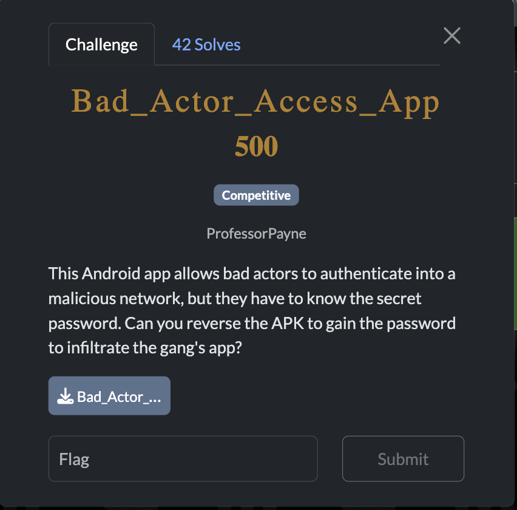
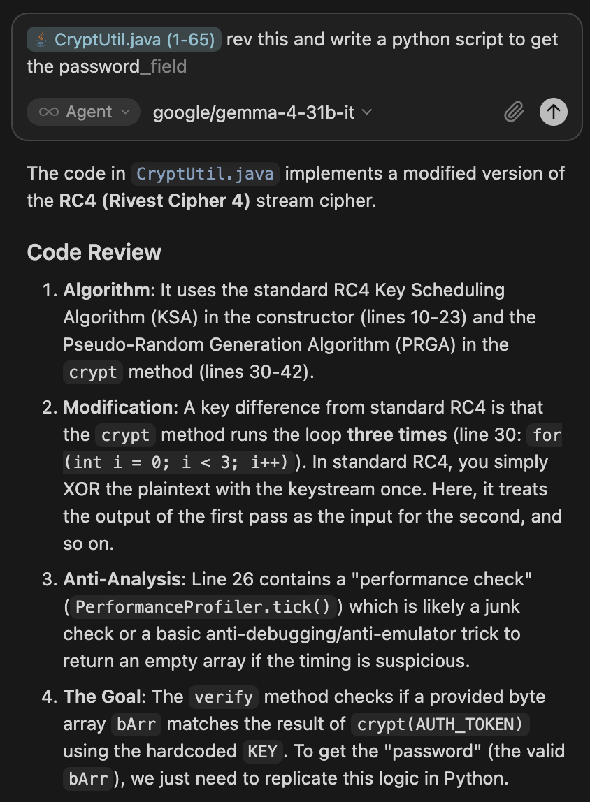
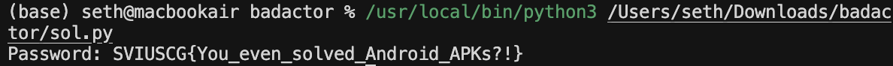

[← US Cyber Open Season VI Writeups](/blog/us-cyber-open-season-vi-writeups)



gemma-4-31b-it solved this entirely on it’s own.



solve script:

```python
def rc4_init(key):
    s = list(range(256))
    j = 0
    for i in range(256):
        j = (j + s[i] + key[i % len(key)]) & 255
        s[i], s[j] = s[j], s[i]
    return s

def solve():
    KEY = [101, 51, 52, 57, 98, 57, 50, 98, 54, 54, 51, 97, 52, 53, 52, 97, 57, 51, 101, 50, 57, 53, 98, 57, 48, 99, 101, 55, 48, 48, 51, 54]
    AUTH_TOKEN = [-120, 75, 9, 22, 104, 110, -102, 62, -71, 12, 26, -29, 30, 77, 82, 49, 103, 20, -34, 127, -30, -37, 74, 67, -99, -28, -69, -55, 16, 113, -82, -64, 18, 79, 72, 37, 90, 101, -68]
    AUTH_TOKEN_UNSIGNED = [b & 0xFF for b in AUTH_TOKEN]

    s = rc4_init(KEY)
    data = AUTH_TOKEN_UNSIGNED

    final_res = [0] * len(data)
    for _ in range(3):
        i = 0
        j = 0
        for k in range(len(data)):
            i = (i + 1) & 255
            j = (j + s[i]) & 255
            s[i], s[j] = s[j], s[i]
            # XOR against the original data every time
            final_res[k] = (s[(s[i] + s[j]) & 255] ^ data[k]) & 0xFF

    password_bytes = bytes(final_res)
    try:
        print(f"Password: {password_bytes.decode('utf-8')}")
    except UnicodeDecodeError:
        print(f"Password (hex): {password_bytes.hex()}")

if __name__ == "__main__":
    solve()

```



Flag: `SVIUSCG{You_even_solved_Android_APKs?!}`
