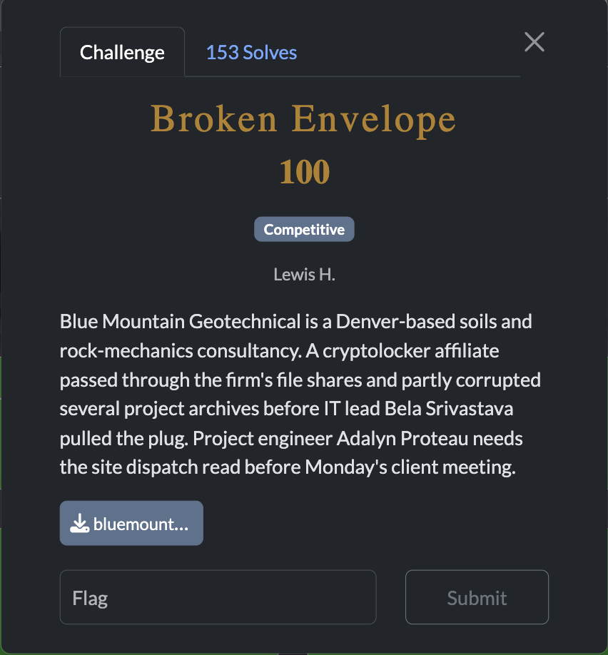
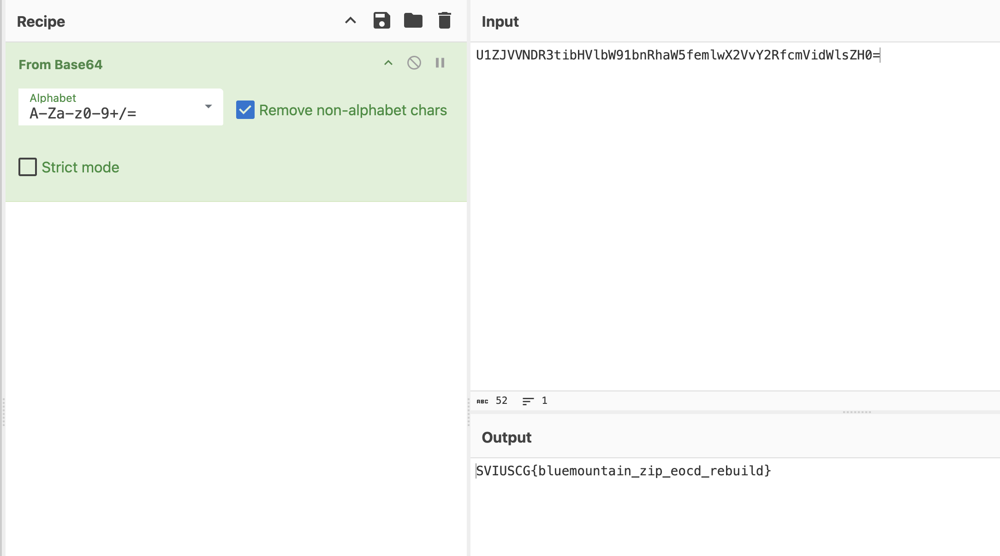

[← US Cyber Open Season VI Writeups](/blog/us-cyber-open-season-vi-writeups)



We’re given a corrupted zip file. Thankfully my unarchiving tool (the unarchiver) auto-repairs it so we can literally just unzip it and the flag is base64 encoded there.

```python
Blue Mountain Geotechnical - project dispatch
tag: U1ZJVVNDR3tibHVlbW91bnRhaW5femlwX2VvY2RfcmVidWlsZH0=
site: Sawatch Ridge borehole 17
```



Flag: `SVIUSCG{bluemountain_zip_eocd_rebuild}`
