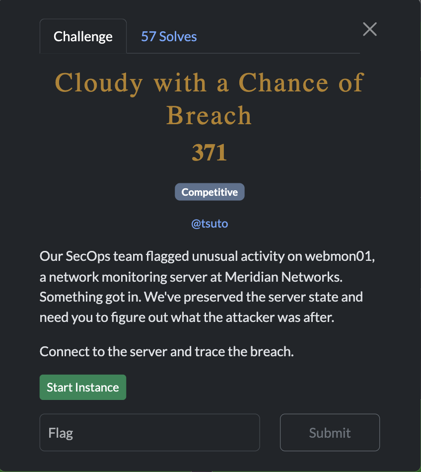
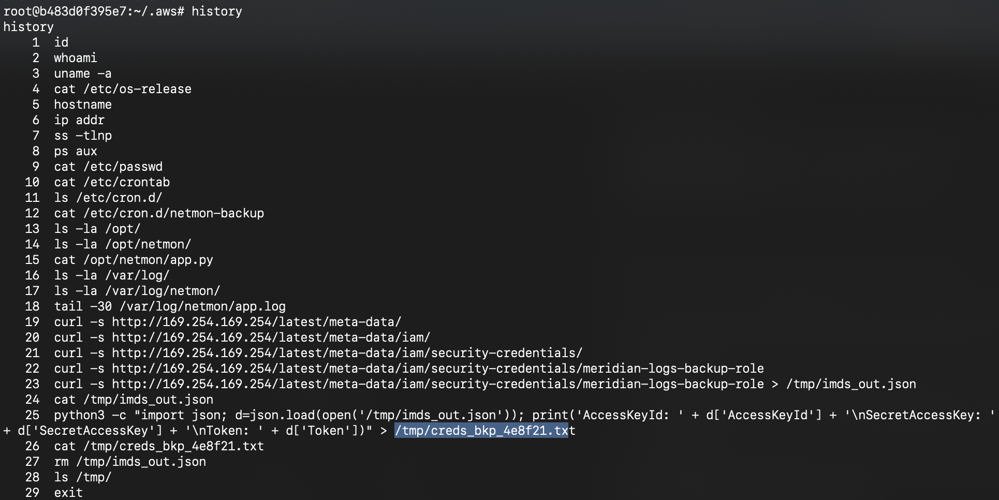
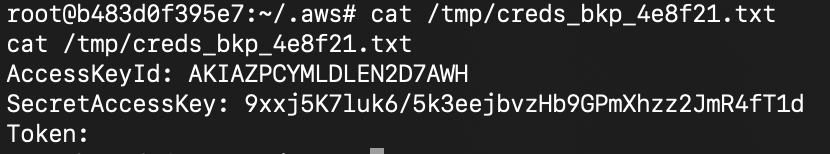
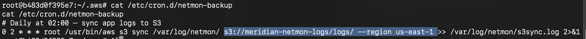
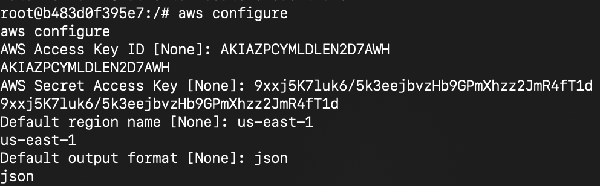
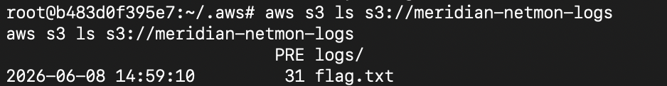
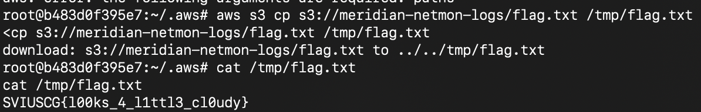

[← US Cyber Open Season VI Writeups](/blog/us-cyber-open-season-vi-writeups)

We are dropped into a linux shell. One of the first things I do is check the shell history of my user with `history` 

Looks like the attacker stores some aws credentials in `/tmp/creds_bkp_4e8f21.txt`

yup:

Checking the crontab entry that was previously viewed shows us the aws region as well as s3 bucket name

Now we can just list what’s in this bucket by entering in the auth details in `aws configure` then reading what’s in the bucket with `aws s3 ls s3://meridian-netmon-logs`

Cool, there’s the flag. Let’s copy it out with `aws s3 cp s3://meridian-netmon-logs/flag.txt /tmp/flag.txt`. Now we can just read it from `/tmp/flag.txt`:

Flag: `SVIUSCG{l00ks_4_l1ttl3_cl0udy}`
