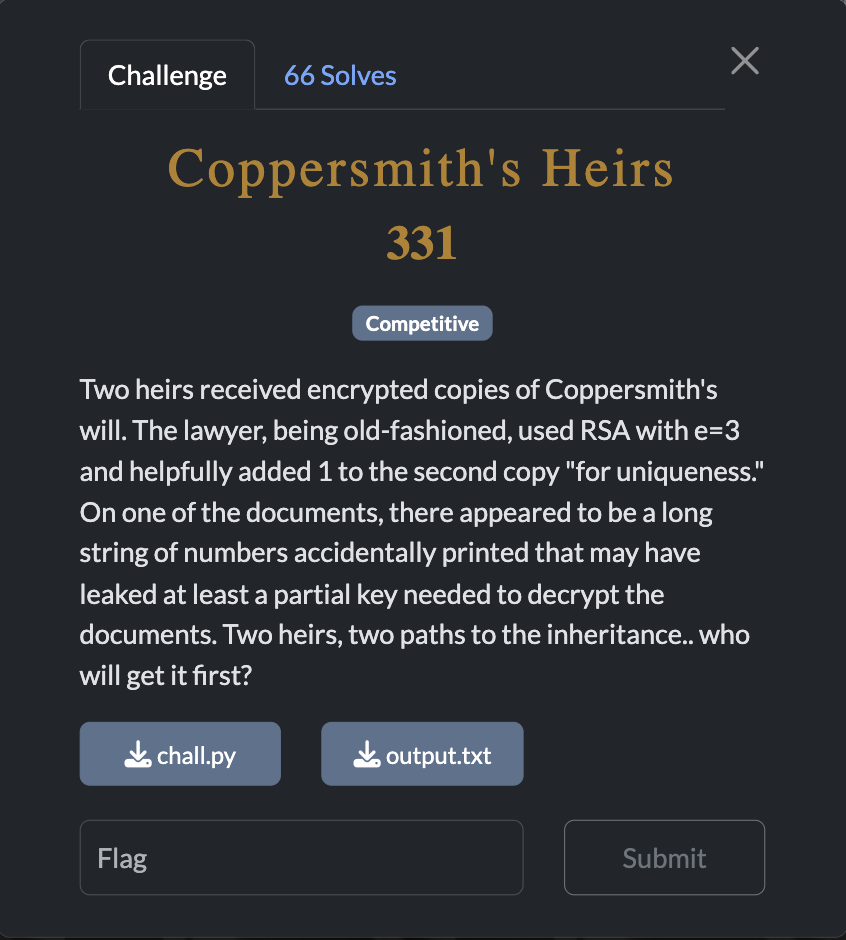
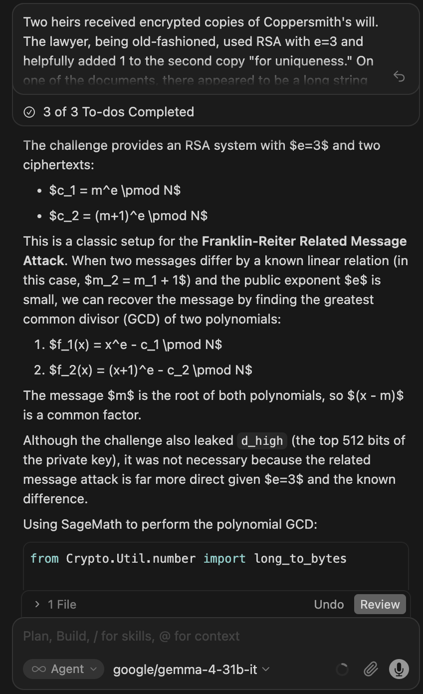

[← US Cyber Open Season VI Writeups](/blog/us-cyber-open-season-vi-writeups)



gemma-4-31b-it also solved this one



```python
from Crypto.Util.number import long_to_bytes

N = 25242631456189260899103953086025597423270381338227101278425339663707221286863571815628817568633363700487351744535327223302902166155224734081357864317697494480015742585201495799365124931714032040973257536285830468868216042553816713280054883129862628603506318548886560770574582787826438548226354262413194850373268643355637925202070532838594033854601698962041514556491317263842400887700032276578064109922106998852012020713187265571676022527382693861112041344317096915949017604970204841686995028544205723017188986614246476526624290916242149669988369169621826988203291645531798341711106625032088919324690744101854252364477
e = 3
c1 = 26636060683933356201841204437377666907271525456413989856427901422837285094809828700289647560426241292625396211795152899193917770890648391593898129758917971520354420943423846038529650780407118497903135120455307924212036374482371916897442296632415698846760038738874255390814501949445020686953715368262807170710544669029
c2 = 26636060683933356201841204437377666907271525456413989856427901422837285094809828700289647560426241292625422968620581653058575356577537137086801190927096827660133801361313014751725605696685192932049286801179194193093887760711136154935160351070836012492813693142994442663240280863805311329527256632832379343378154731000
d_high = 6981842180637845835306627656488419009021601787950505717255402290150849711861355614925645009171103791175022258269702883908308702475893758669691844980927810
shift = 1536

# Franklin-Reiter Related Message Attack
# c1 = m^e mod N
# c2 = (m+1)^e mod N
# We can recover m using the GCD of two polynomials
# f1(x) = x^e - c1
# f2(x) = (x+1)^e - c2

P.<x> = PolynomialRing(Zmod(N))
f1 = x^e - c1
f2 = (x + 1)^e - c2

def gcd(a, b):
    while b:
        a, b = b, a % b
    return a.monic()

res = gcd(f1, f2)
m = -res.coefficients()[0]
print(long_to_bytes(int(m)).decode())

```

Flag: `SVIUSCG{c0pp3r5m1th_fr4nkl1n_r3173r_ch41n3d}`
