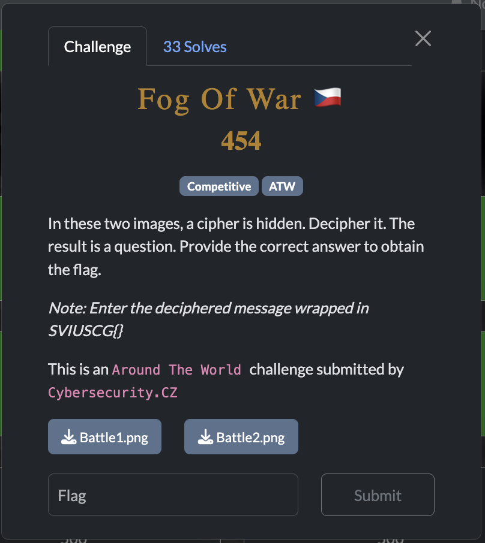
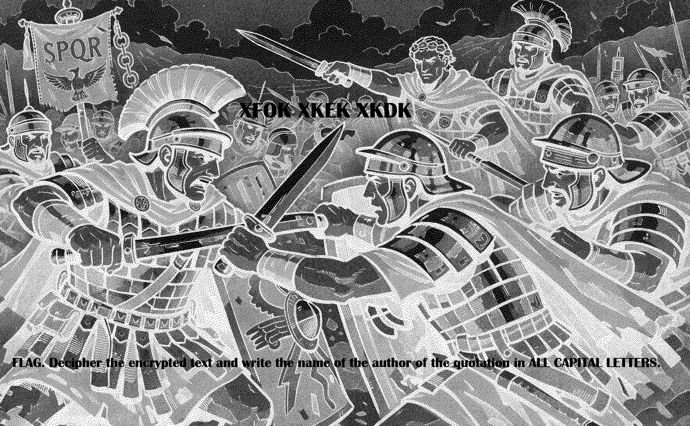

[← US Cyber Open Season VI Writeups](/blog/us-cyber-open-season-vi-writeups)

We are given two images of seemingly noise, but when you take the XOR of them you get:

The quote XFOK XKEK XKDK I couldn’t figure out how to decrypt but 3 words of 4 letters each looks a lot like it could represent “VENI VIDI VICI” which is a famous quote by Julius Caesar and matches the theme.

`SVIUSCG{CAESAR}`
