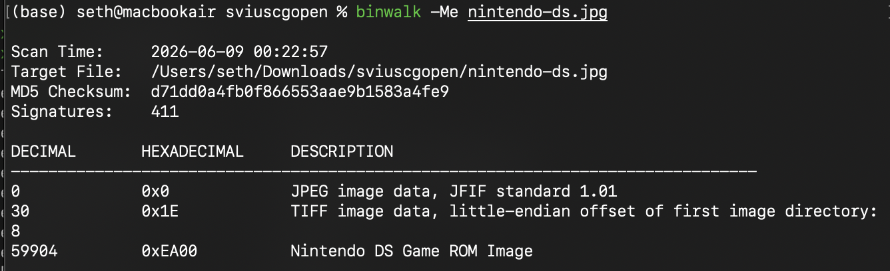
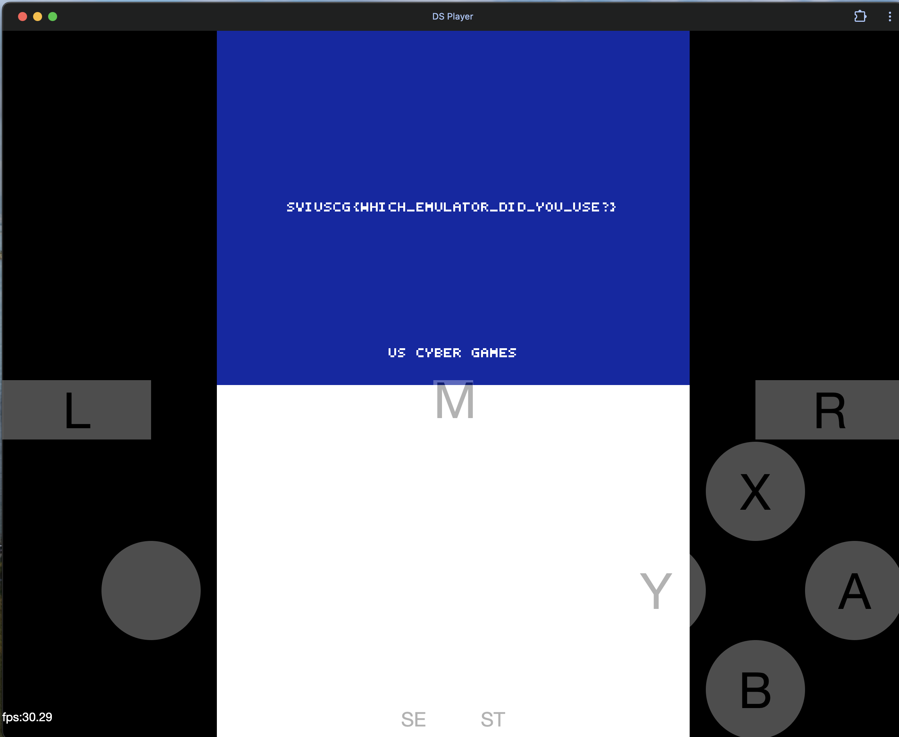

[← US Cyber Open Season VI Writeups](/blog/us-cyber-open-season-vi-writeups)

We’re given an innocuous looking jpeg. let’s run `binwalk` on it to see what files may lie within:

Looks like there’s a DS rom in there. I extracted it from that offset(59904): `dd if=nintendo-ds.jpg bs=1 skip=59904 of=extracted_rom.nds`

Then loaded it into an emulator ([https://ds.44670.org/](https://ds.44670.org/)). When we play the game, we see the flag!

Flag: `SVIUSCG{WHICH_EMULATOR_DID_YOU_USE?}`
