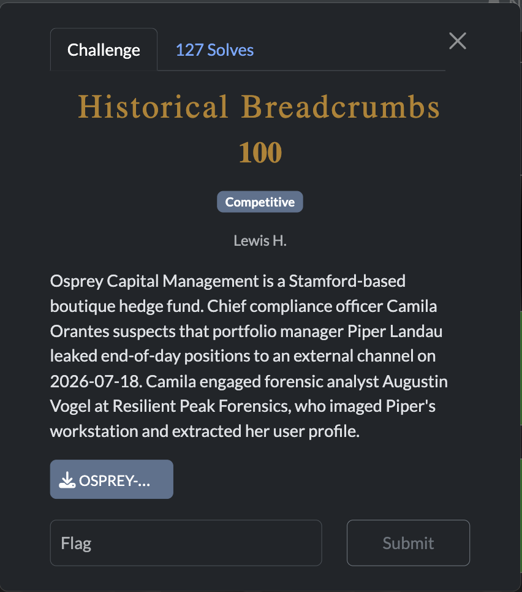
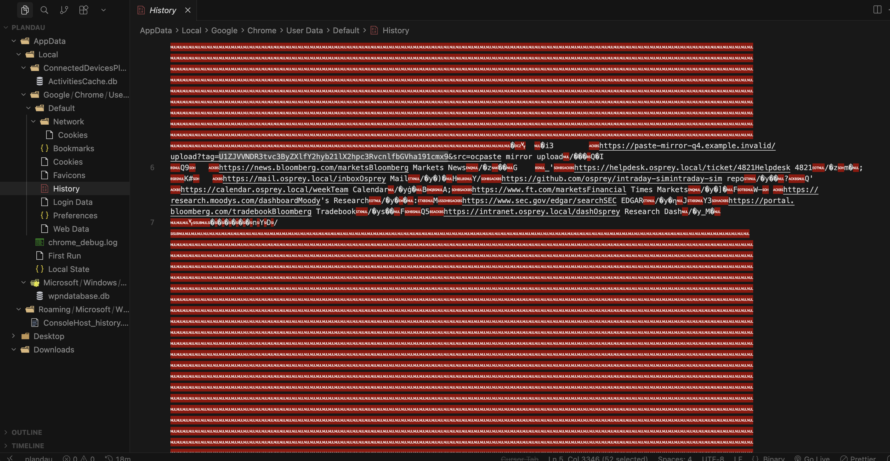
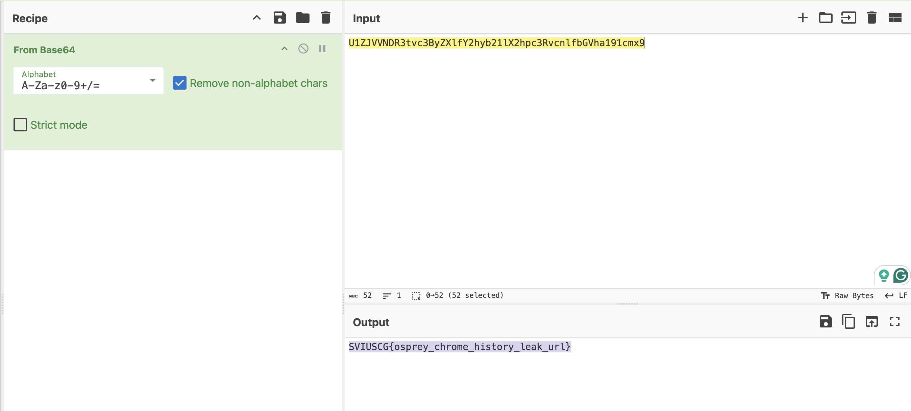

[← US Cyber Open Season VI Writeups](/blog/us-cyber-open-season-vi-writeups)

We’re given some files from a Windows system. One of the files has base64 in the db which decodes to the flag.

Flag: `SVIUSCG{osprey_chrome_history_leak_url}`
