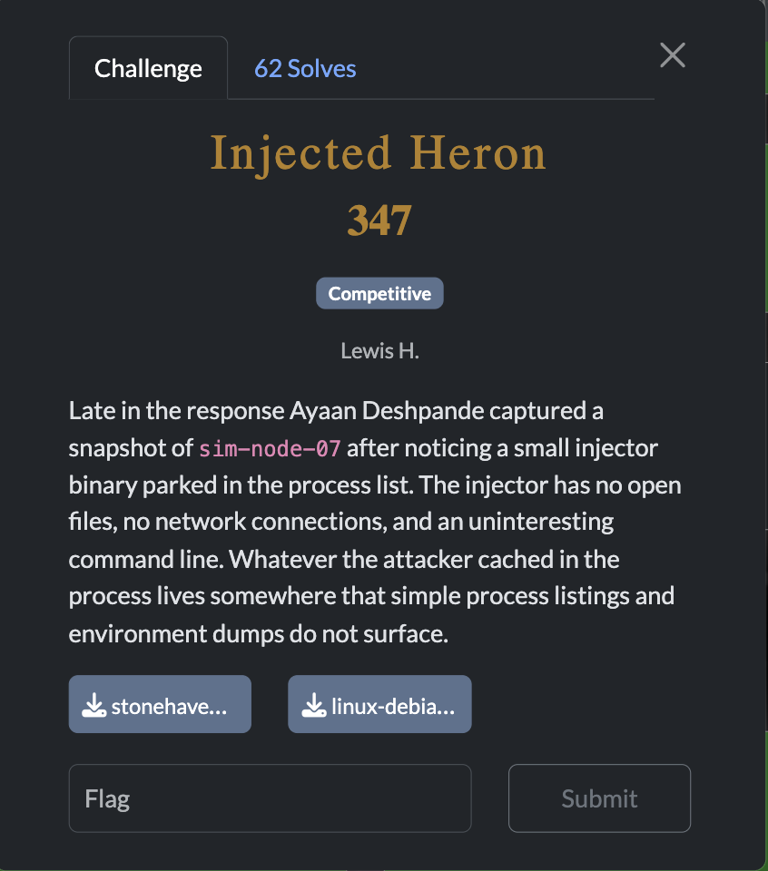
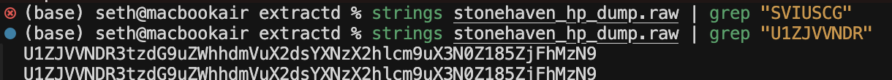
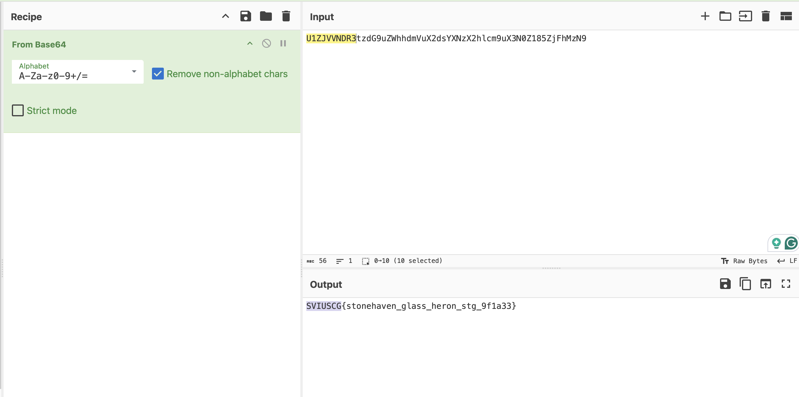

[← US Cyber Open Season VI Writeups](/blog/us-cyber-open-season-vi-writeups)

We’re given this memory dump. This solution was definitely unintended. I just ran strings and grepped for `U1ZJVVNDR`since that’s the base64 encoding of `SVIUSC`, part of the flag format (I had noticed a pattern of the flag being base64 encoded in previous forensics challenges).

Flag: `SVIUSCG{stonehaven_glass_heron_stg_9f1a33}`
