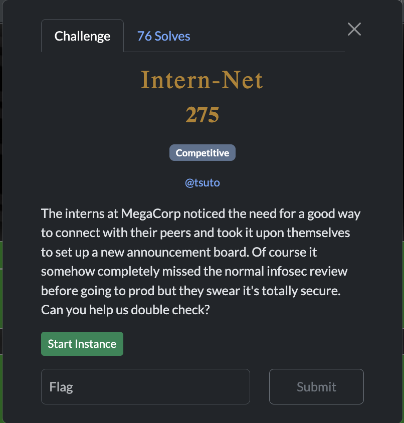
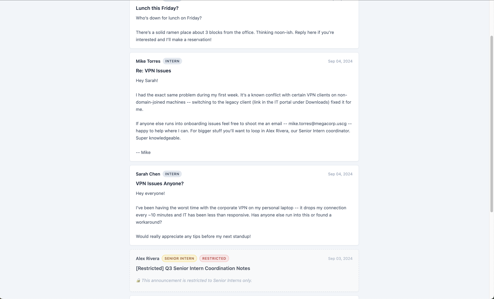
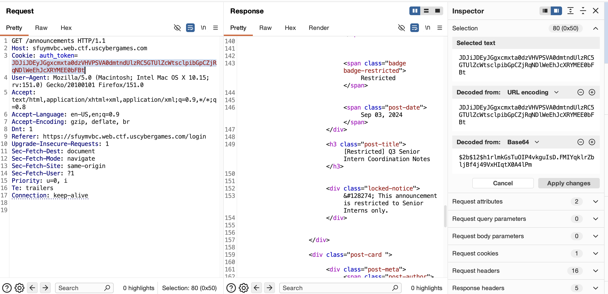
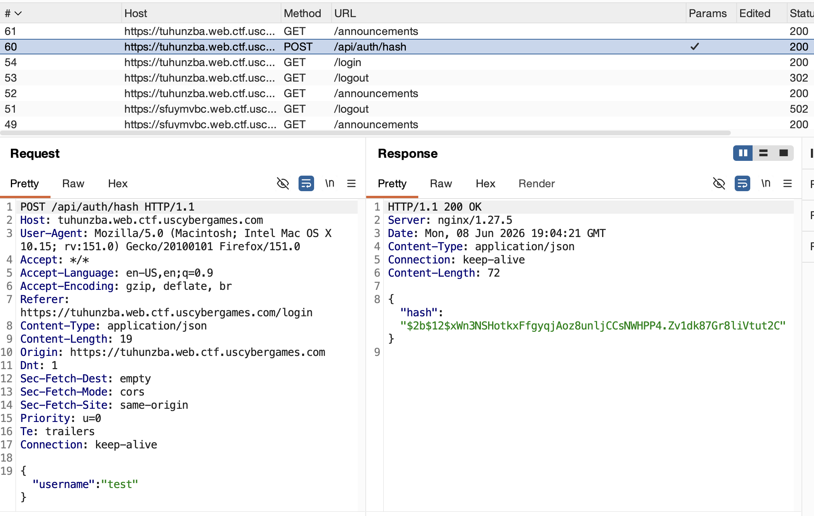
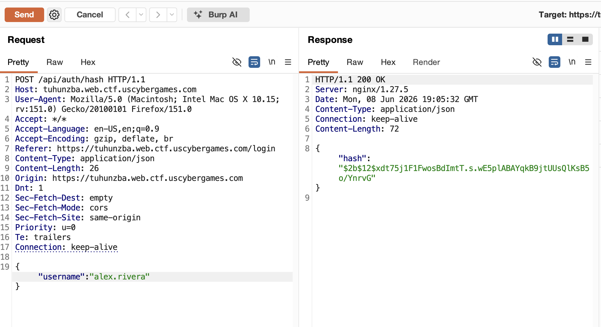
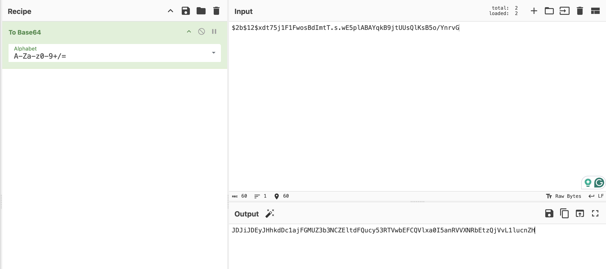
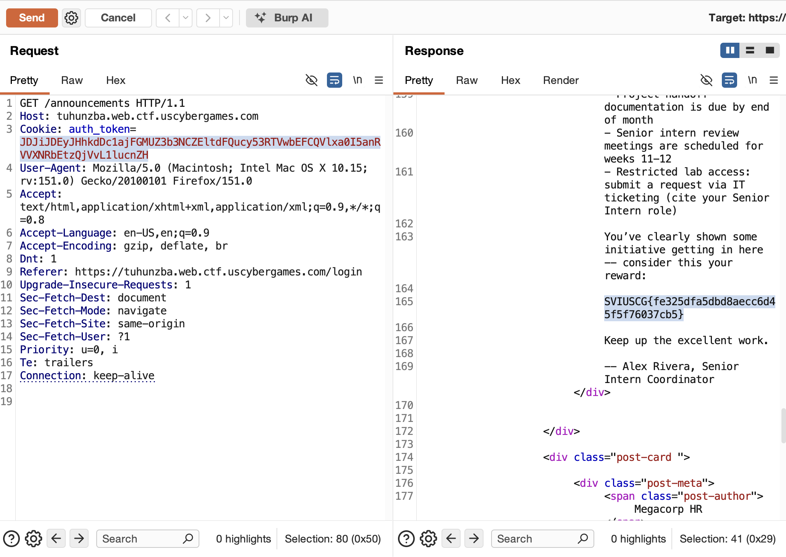

[← US Cyber Open Season VI Writeups](/blog/us-cyber-open-season-vi-writeups)

We’re given a website where we can create an account but can’t see the secret post, you have to be a senior intern for that.

Since mike torres’s username is mike.torres, maybe alex revera (the guy with senior intern permissions’) username is just `alex.rivera`? 

Let’s see if we can log into his account on the announcements page to read the secret message.

When intercepting the request sent, we can see it’s just authenticated by this `auth_token` cookie, which is a base64 encoding of the user’s password hash.

Looking at the http history from browsing the site, we can see where the client gets that hash from, the server provides it!

This request is unauthenticated, though, meaning we can just request the password hash for any user. Let’s fetch `alex.rivera`’s password hash.

Now we can base64 encode that and use it to read the announcements page as him:

There’s the secret message with the flag!

Flag: `SVIUSCG{fe325dfa5dbd8aecc6d45f5f76037cb5}`
