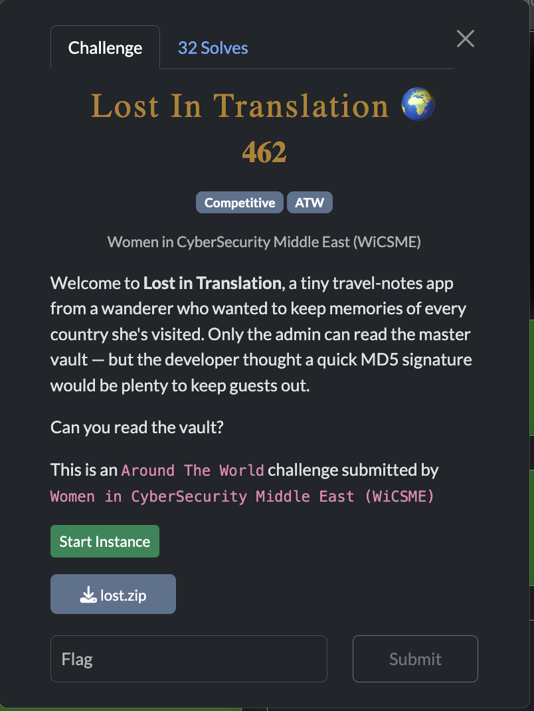
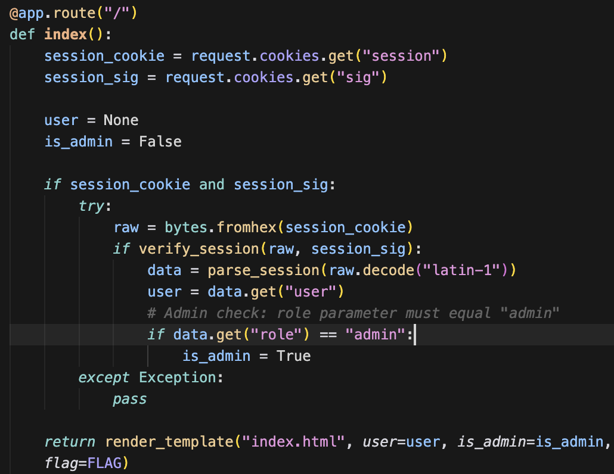
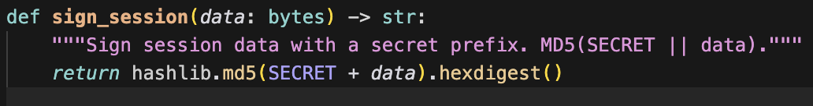
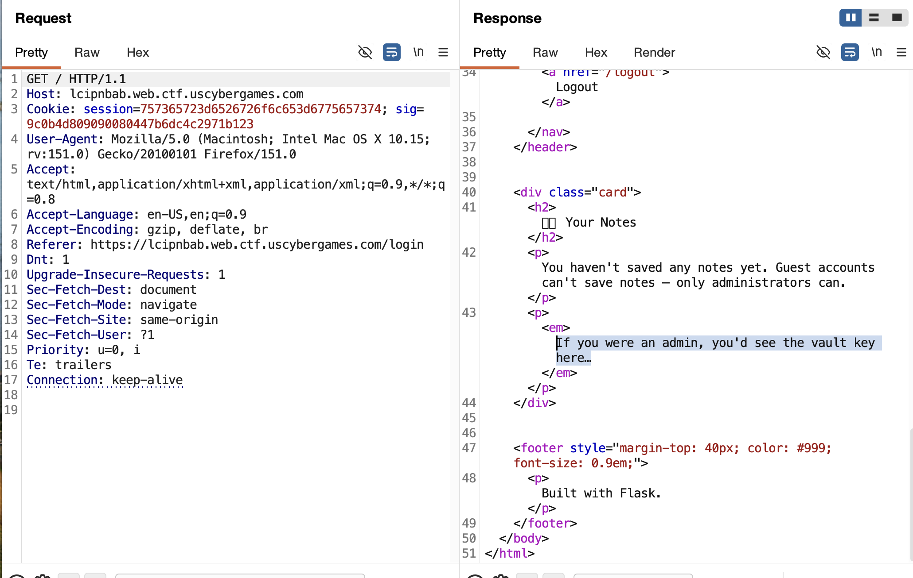
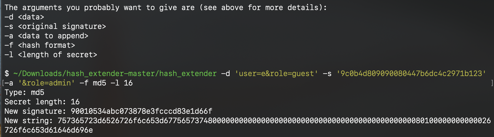
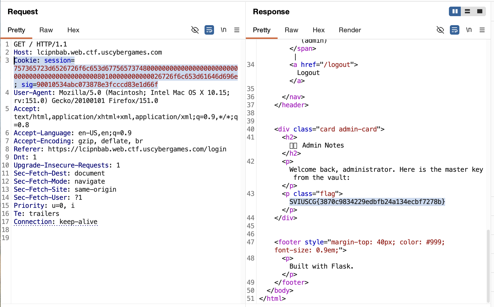

[← US Cyber Open Season VI Writeups](/blog/us-cyber-open-season-vi-writeups)

The site appears to only show us the flag if we have the `session` cookie resolve to role=admin and have a valid signature (md5 hash) of that session as the `sig` cookie.

We could just modify the session cookie to have `&role=admin` at the end so that we can read the flag but then the signature wouldn’t match since we don’t know the SECRET which is prepended to the session before hashing.

It turns out there’s a way to forge a hash that includes the initial `SECRET + data` as well as some arbitrary data appended to the end with the hash length extension attack. We can resume the md5 algorithm where it left off using [https://github.com/iagox86/hash_extender](https://github.com/iagox86/hash_extender) to get the full `md5(SECRET+data+'&role=admin')`.  The hash extender tool also requires knowing the length of `SECRET` but it turns out we can just try every possibility until we find a length that works. Once we try length 16, it works!

Here’s the original request with session `user=e&role=guest`:

Now we can use that session and signature and we get the flag!

Flag: `SVIUSCG{3870c9834229edbfb24a134ecbf7278b}`
