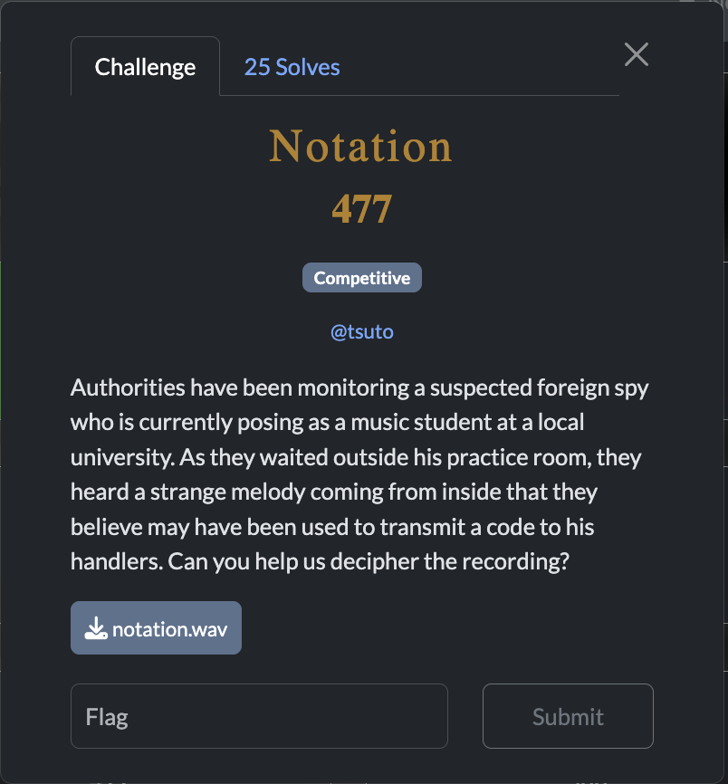
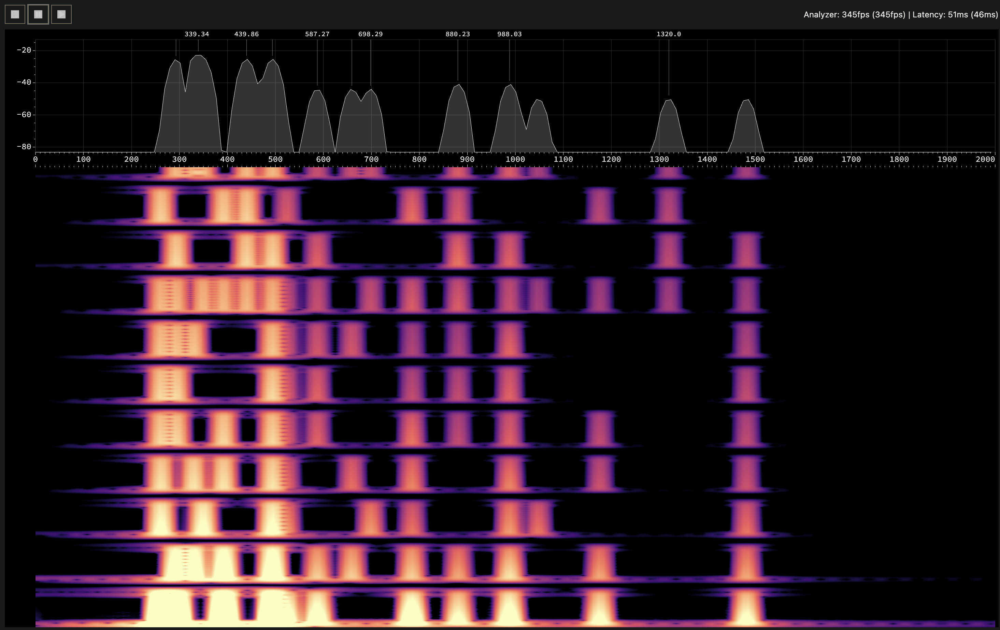
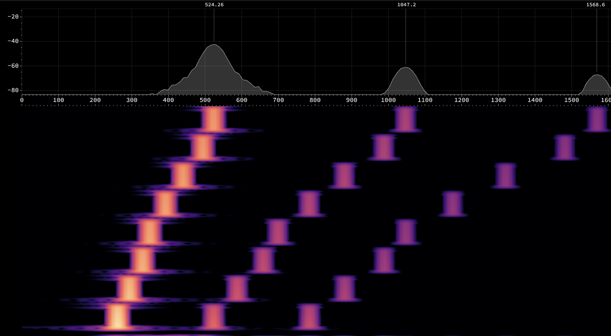
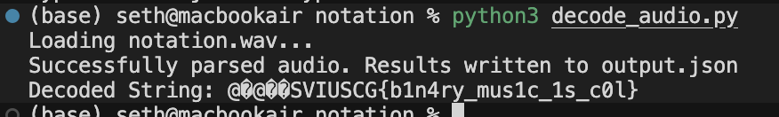

[← US Cyber Open Season VI Writeups](/blog/us-cyber-open-season-vi-writeups)



We’re given a .wav file which is just some notes played, but I decided to look at it under a [spectrogram](https://donghaoren.org/spectrum-analyzer/) and we can see there’s definitely some kind of data encoded here:



Judging by these 8 sequential tones played at the start, each note represents a bit, and the ones played together at once represent 1s in each byte.



To parse it like this, I wrote down the frequencies that each note seemed to center at in the initial scale, and then had gemma-4-31b-it write a script to split the file into segments based on when the notes being played changed, and analyze each portion for which notes were being played. Then each segment would be turned into a byte and displayed as text.


#### The script gemma-4-31b-it generated

```python
import librosa
import numpy as np
import json

def parse_audio_binary(file_path):
    print(f"Loading {file_path}...")
    y, sr = librosa.load(file_path, sr=None)

    # Target frequencies based on user specifications (C4 to C5)
    target_freqs = [
        261.5,  # C4
        293.66,  # D4
        329.63,  # E4
        349.23,  # F4
        392.00,  # G4
        440.00,  # A4
        493.88,  # B4
        523.17,  # C5
    ]

    n_fft = 8192
    hop_length = 512

    stft = np.abs(librosa.stft(y, n_fft=n_fft, hop_length=hop_length))
    freqs = librosa.fft_frequencies(sr=sr, n_fft=n_fft)

    bin_indices = [np.argmin(np.abs(freqs - f)) for f in target_freqs]

    # 1. Raw state detection per frame
    raw_frame_states = []
    for t_idx in range(stft.shape[1]):
        magnitude = stft[:, t_idx]
        frame_max = np.max(magnitude)

        if frame_max < 0.1:  # Silence threshold
            raw_frame_states.append(None)
            continue

        state = 0
        for bit_idx, bin_idx in enumerate(bin_indices):
            # Threshold set to 0.4 to avoid side-lobes
            if magnitude[bin_idx] > frame_max * 0.4:
                state |= 1 << bit_idx
        raw_frame_states.append(state)

    # 2. Smoothing to prevent mid-note splices (Majority Vote)
    # We use a window to filter out transient fluctuations in the spectrum
    window_size = 15
    frame_states = []
    for i in range(len(raw_frame_states)):
        start = max(0, i - window_size // 2)
        end = min(len(raw_frame_states), i + window_size // 2 + 1)
        window = raw_frame_states[start:end]

        valid_states = [s for s in window if s is not None]
        if not valid_states:
            frame_states.append(None)
        else:
            vals, counts = np.unique(valid_states, return_counts=True)
            frame_states.append(vals[np.argmax(counts)])

    # 3. Splicing based on smoothed state changes
    segments = []
    if not frame_states:
        return segments

    i = 0
    while i < len(frame_states):
        if frame_states[i] is None:
            i += 1
            continue

        start_i = i
        while i < len(frame_states) and frame_states[i] is not None:
            i += 1

        region = frame_states[start_i:i]
        if not region:
            continue

        current_state = region[0]
        seg_start = start_i

        for j in range(1, len(region)):
            if region[j] != current_state:
                segments.append((seg_start, start_i + j, current_state))
                seg_start = start_i + j
                current_state = region[j]

        segments.append((seg_start, start_i + len(region), current_state))

    # Prepare final data and debug info for JSON
    final_output = []
    for start, end, state in segments:
        binary_repr = bin(state)[2:].zfill(8)[::-1]  # LSB first

        # Debug info from the first frame of the segment
        mag = stft[:, start]
        frame_max = np.max(mag)
        peak_vals = [mag[idx] for idx in bin_indices]

        final_output.append(
            {
                "segment_index": len(final_output) + 1,
                "start_frame": int(start),
                "end_frame": int(end),
                "binary": binary_repr,
                "decimal_value": int(state),
                "debug": {
                    "frame_max": float(frame_max),
                    "peak_values": [float(v) for v in peak_vals],
                    "ratios": [
                        float(v / frame_max) if frame_max > 0 else 0 for v in peak_vals
                    ],
                },
            }
        )

    return final_output

if __name__ == "__main__":
    input_file = "notation.wav"
    output_file = "output.json"

    try:
        results = parse_audio_binary(input_file)

        bytes_list = [item["decimal_value"] for item in results]
        try:
            decoded_text = bytes(bytes_list).decode("utf-8", errors="replace")
        except:
            decoded_text = "Could not decode"

        output_payload = {
            "metadata": {
                "input_file": input_file,
                "decoded_string": decoded_text,
                "total_segments": len(results),
            },
            "segments": results,
        }

        with open(output_file, "w") as f:
            json.dump(output_payload, f, indent=4)

        print(f"Successfully parsed audio. Results written to {output_file}")
        print(f"Decoded String: {decoded_text}")

    except Exception as e:
        print(f"Error: {e}")
        import traceback

        traceback.print_exc()
```




Notably, it missed the second 0 in `c00l` but I added it in manually before submitting the flag.

Flag: `SVIUSCG{b1n4ry_mus1c_1s_c00l}`
