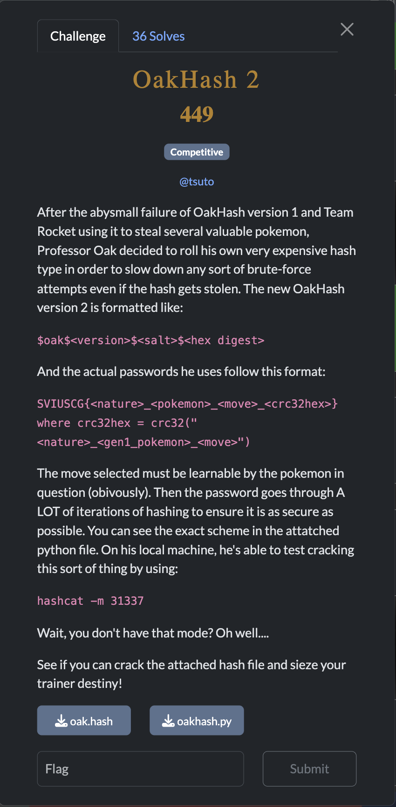
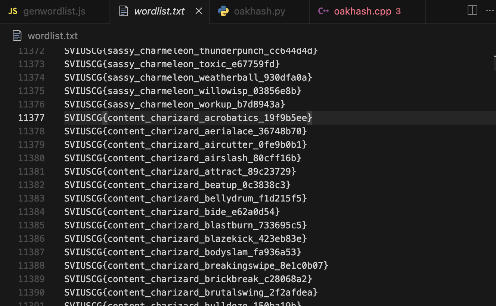
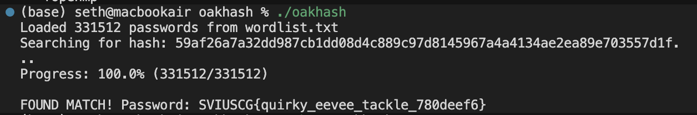
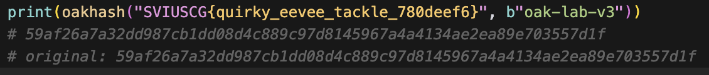

[← US Cyber Open Season VI Writeups](/blog/us-cyber-open-season-vi-writeups)



We’re given the hash `$oak$2$oak-lab-v3$59af26a7a32dd987cb1dd08d4c889c97d8145967a4a4134ae2ea89e703557d1f` to crack.

We know the password is of format `SVIUSCG{<nature>_<pokemon>_<move>_<crc32hex>}`, so first I made a wordlist of every possible combination of that. What was most helpful in building it was the list of moves each pokemon can learn [https://raw.githubusercontent.com/smogon/pokemon-showdown/master/data/learnsets.ts](https://raw.githubusercontent.com/smogon/pokemon-showdown/master/data/learnsets.ts). I appended this script to the end of that so it can just load the same datasource for moves-per-pokemon directly in javascript.

```jsx
  const gen1Path = path.join(__dirname, "gen1.txt");
  const gen1Text = fs.readFileSync(gen1Path, "utf8");
  let pokemonList = gen1Text.trim().split("\n");
  pokemonList = pokemonList.map((item) => item.toLowerCase())

  const naturePath = path.join(__dirname, "nature.txt");
  const natureText = fs.readFileSync(naturePath, "utf8");
  const natureList = natureText.trim().split("\n");

  const movesData = {};
  
  for (const [pokemonName, pokemonData] of Object.entries(pokemon)) {
    if (pokemonData.learnset) {
      const moves = [];
      for (const [moveName, moveInfo] of Object.entries(pokemonData.learnset)) {
        moves.push(moveName);
      }
      movesData[pokemonName] = moves;
    }
  }

  const entries = [];
  for (const pokemon of pokemonList) {
    for (const nature of natureList) {
      if (!movesData[pokemon]) continue;
      for (const move of movesData[pokemon]) {
        const inputString = `${nature}_${pokemon}_${move}`;
        const crc32hash = crc32(inputString);
        const entry = `SVIUSCG{${nature}_${pokemon}_${move}_${crc32hash}}`;
        entries.push(entry);
      }
    }
  }
```



Running the given hashing function (65536 rounds of sha256) in python was taking too long, so I had gemma-4-31b-it rewrite the hashing algorithm in c++.


#### Script that gemma-4-31b-it generated

```cpp
#include <iostream>
#include <vector>
#include <string>
#include <iomanip>
#include <sstream>
#include <fstream>
#include <openssl/sha.h>
#include <zlib.h>
#include <omp.h>
#include <atomic>

// Rotates a byte left by 3 bits
inline uint8_t rotl3(uint8_t x) {
    return (uint8_t)((x << 3) | (x >> 5));
}

std::string oakhash(const std::string& password, const std::string& salt) {
    uint32_t crc = crc32(0L, (const Bytef*)password.c_str(), password.length());
    uint8_t cbytes[4];
    cbytes[0] = (crc >> 0) & 0xFF;
    cbytes[1] = (crc >> 8) & 0xFF;
    cbytes[2] = (crc >> 16) & 0xFF;
    cbytes[3] = (crc >> 24) & 0xFF;

    uint8_t x[32];
    std::string init_input = salt + password;
    SHA256((const unsigned char*)init_input.c_str(), init_input.length(), x);

    // Pre-allocate a buffer to avoid repeated allocations in the loop
    // Max size: 32 (block) + password length + 2 (index)
    std::vector<uint8_t> buffer(32 + password.length() + 2);

    for (uint32_t i = 0; i < 65536; ++i) {
        for (int j = 0; j < 32; ++j) {
            buffer[j] = rotl3(x[j] ^ cbytes[(i + j) % 4]);
        }
        
        // Copy password into buffer after the 32-byte block
        std::copy(password.begin(), password.end(), buffer.begin() + 32);
        
        // Append index as 2 bytes little-endian
        buffer[32 + password.length()] = i & 0xFF;
        buffer[32 + password.length() + 1] = (i >> 8) & 0xFF;

        SHA256(buffer.data(), buffer.size(), x);
    }

    std::stringstream ss;
    for(int i = 0; i < 32; i++)
        ss << std::hex << std::setw(2) << std::setfill('0') << (int)x[i];
    return ss.str();
}

int main() {
    std::string target = "59af26a7a32dd987cb1dd08d4c889c97d8145967a4a4134ae2ea89e703557d1f";
    std::string salt = "oak-lab-v3";
    std::string wordlist_file = "wordlist.txt";

    std::ifstream file(wordlist_file);
    if (!file.is_open()) {
        std::cerr << "Could not open wordlist.txt" << std::endl;
        return 1;
    }

    std::vector<std::string> passwords;
    std::string line;
    while (std::getline(file, line)) {
        if (!line.empty()) passwords.push_back(line);
    }
    file.close();

    size_t total_passwords = passwords.size();
    std::cout << "Loaded " << total_passwords << " passwords from " << wordlist_file << std::endl;
    std::cout << "Searching for hash: " << target << "..." << std::endl;

    std::atomic<size_t> processed_count(0);
    bool found = false;
    std::string found_password = "";

    #pragma omp parallel for
    for (int i = 0; i < (int)total_passwords; ++i) {
        if (oakhash(passwords[i], salt) == target) {
            #pragma omp critical
            {
                found = true;
                found_password = passwords[i];
            }
        }

        // Update progress periodically to avoid slowing down threads
        size_t current = ++processed_count;
        if (current % 1 == 0 || current == total_passwords) {
            #pragma omp critical
            {
                double percent = (100.0 * current) / total_passwords;
                std::cout << "\rProgress: " << std::fixed << std::setprecision(1) 
                          << percent << "% (" << current << "/" << total_passwords << ")" << std::flush;
            }
        }
    }

    if (found) {
        std::cout << "\n\nFOUND MATCH! Password: " << found_password << std::endl;
    } else {
        std::cout << "\n\nPassword not found in wordlist." << std::endl;
    }

    return 0;
}
```




Let’s just confirm that this hashes to the final hash.



It does! Flag: `SVIUSCG{quirky_eevee_tackle_780deef6}`
