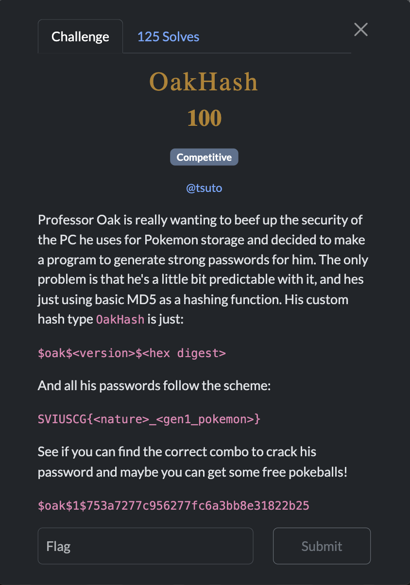
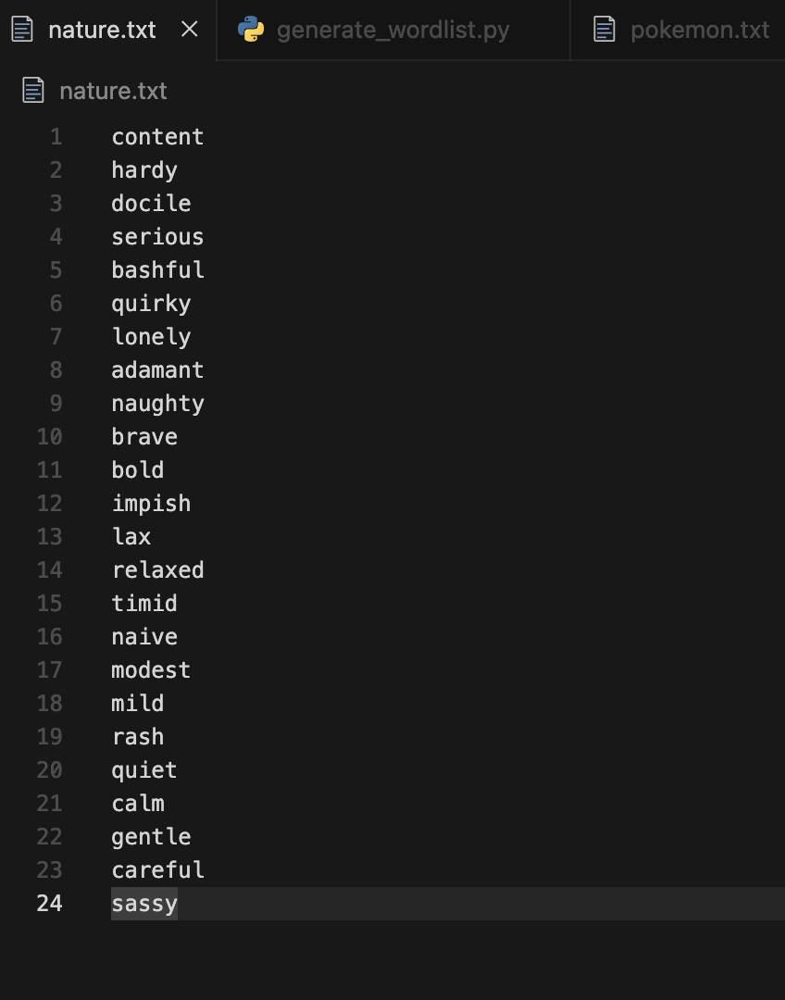
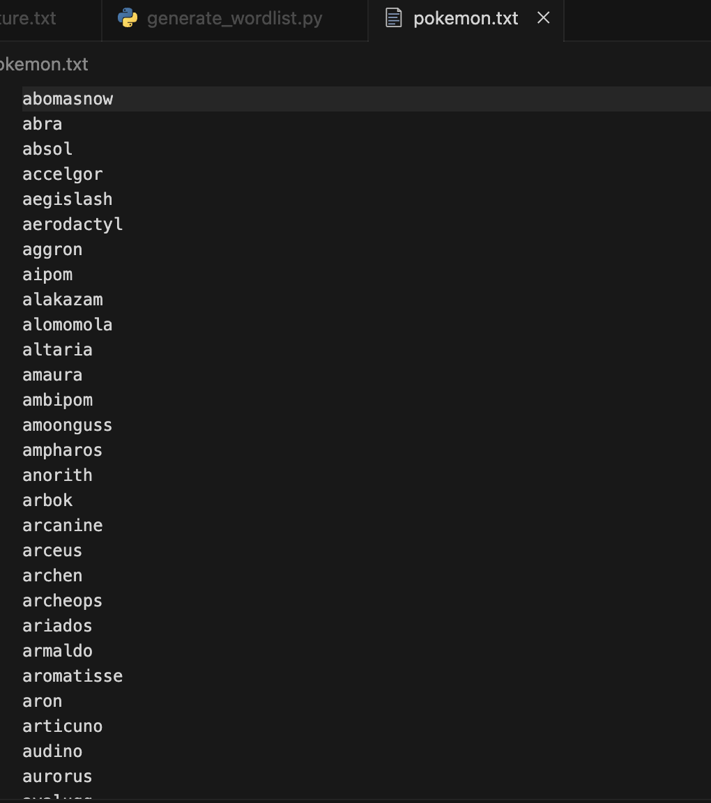
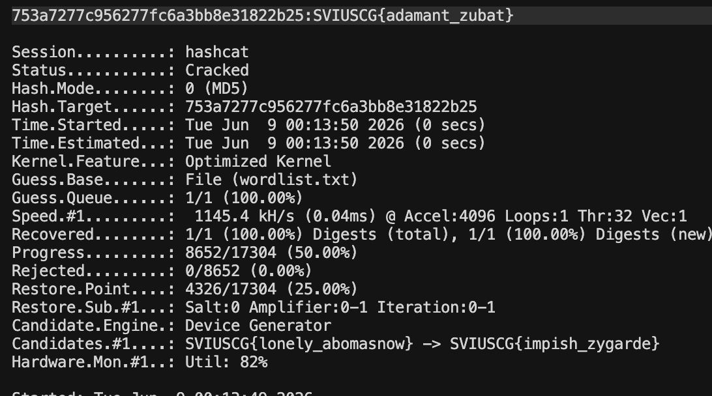

[← US Cyber Open Season VI Writeups](/blog/us-cyber-open-season-vi-writeups)



We’re given a custom hash `$oak$1$753a7277c956277fc6a3bb8e31822b25` where `753a7277c956277fc6a3bb8e31822b25` is the md5sum of the password and the password is in format `SVIUSCG{<pokemon nature>_<gen1 pokemon name>}`

I found a list of gen1 pokemons and list of pokemon natures online and pasted them into text files





Then combined the two wordlists into all combinations using a python script

```python
with open("nature.txt", "r") as f:
    natures = [line.strip() for line in f]

with open("pokemon.txt", "r") as f:
    pokemons = [line.strip() for line in f]

with open("wordlist.txt", "w") as f:
    for nature in natures:
        for pokemon in pokemons:
            f.write(f"SVIUSCG{{{nature}_{pokemon}}}\n")
```

With that final wordlist used hashcat: `hashcat -a 0 -m 0 '753a7277c956277fc6a3bb8e31822b25' wordlist.txt`

and cracked it:



Flag: `SVIUSCG{adamant_zubat}`
