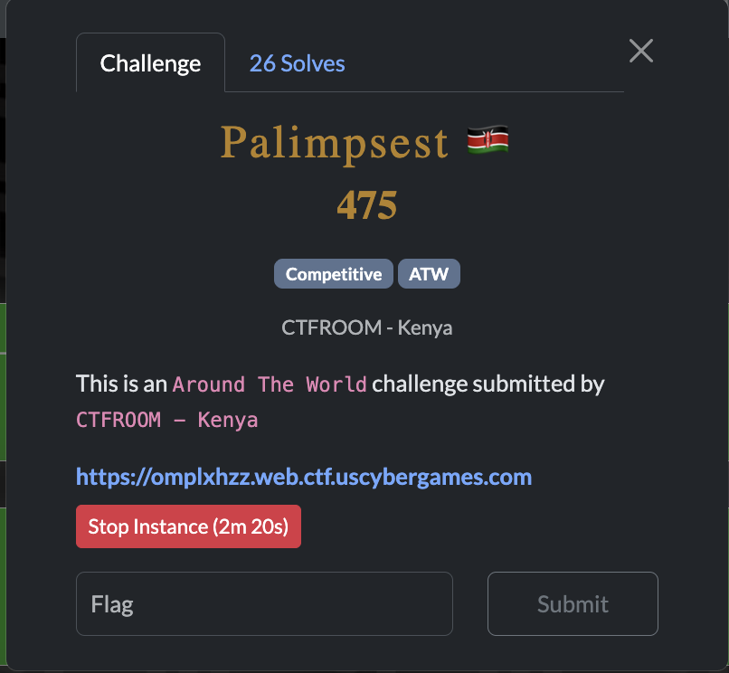
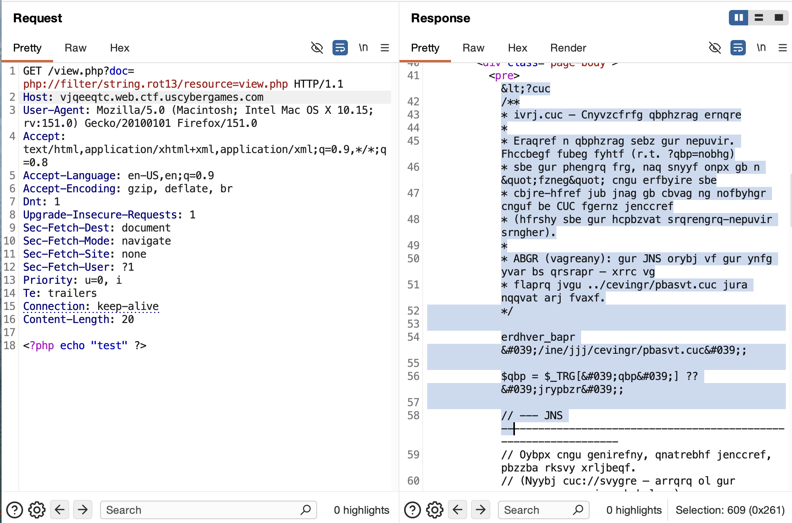
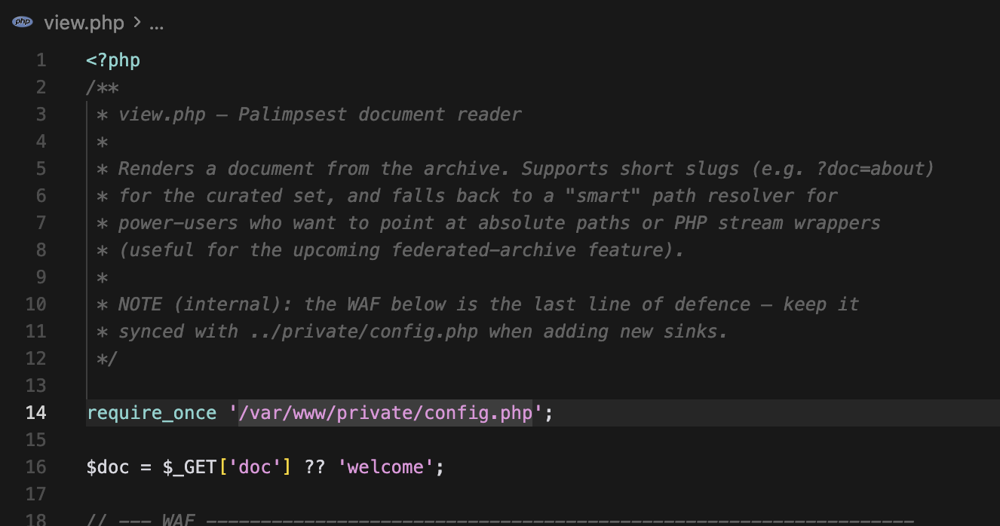
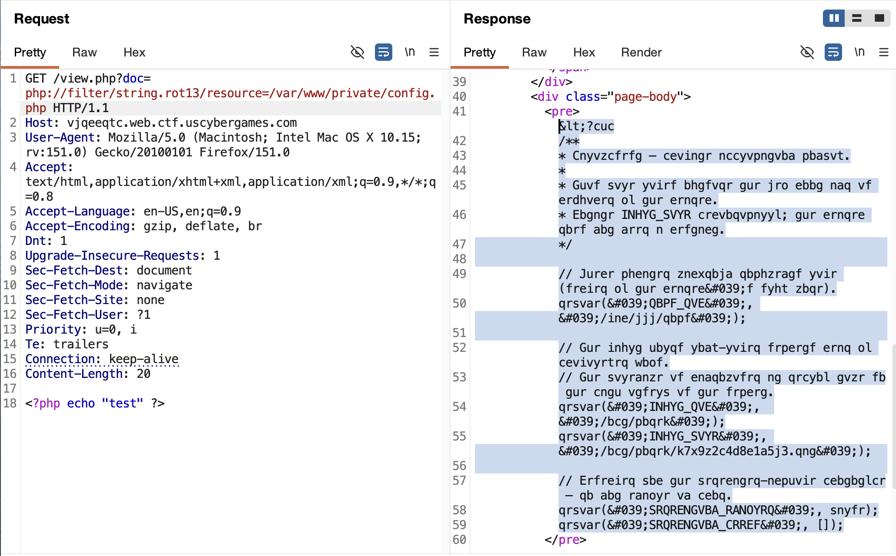
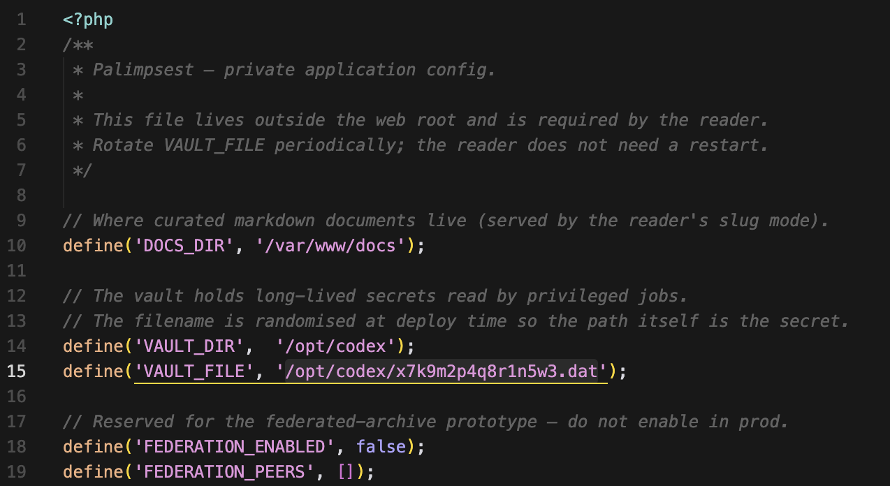
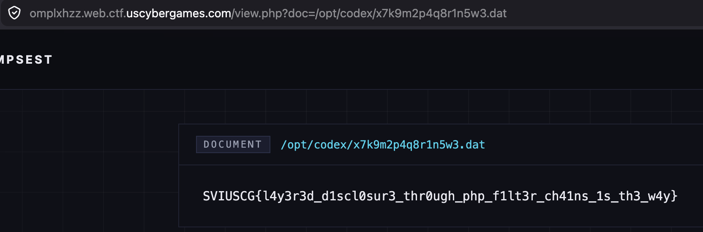

[← US Cyber Open Season VI Writeups](/blog/us-cyber-open-season-vi-writeups)



We get this php website where we can view files from the backend through view.php. There’s a bit of a blacklist preventing us from doing most things, but notably `php://filter` is allowed, and so is `string.rot13`, meaning we can do `/view.php?doc=php://filter/string.rot13/resource=view.php` and then rot13 again to see the view.php source code (I found that rot13 wasn’t on the blacklist even though base64 is through trial and error).



After applying rot13, we see the source. Here’s the blacklist:

```php
$blocked = [
    '..', '\\', "\0",
    'flag',
    'data:', 'file:', 'expect:', 'phar:', 'zip:', 'glob:', 'http',
    'base64', 'b64',
];
```

There’s a reference to `/var/www/private/config.php` as well



Let’s try fetching that as well:



After decoding with rot13:



Looks like there is some kind of secret at `/opt/codex/x7k9m2p4q8r1n5w3.dat`



And there’s the flag: `SVIUSCG{l4y3r3d_d1scl0sur3_thr0ugh_php_f1lt3r_ch41ns_1s_th3_w4y}`
