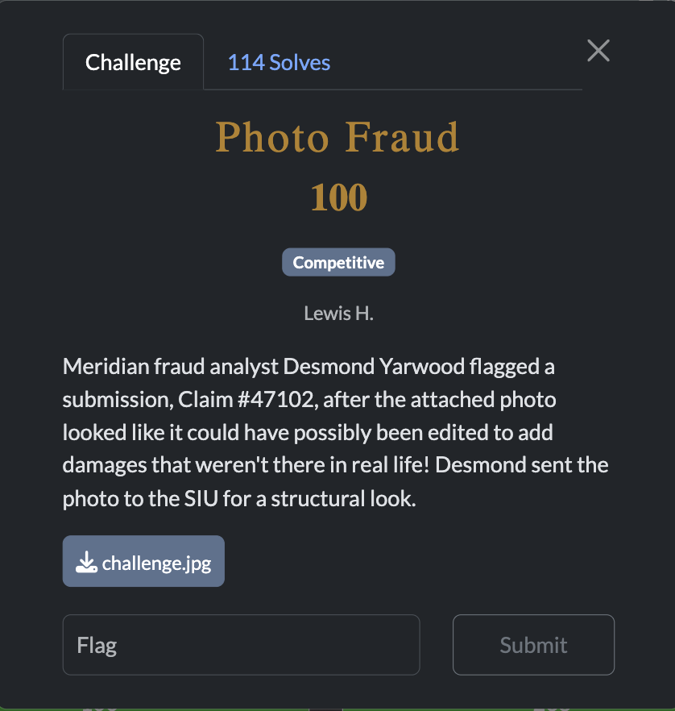
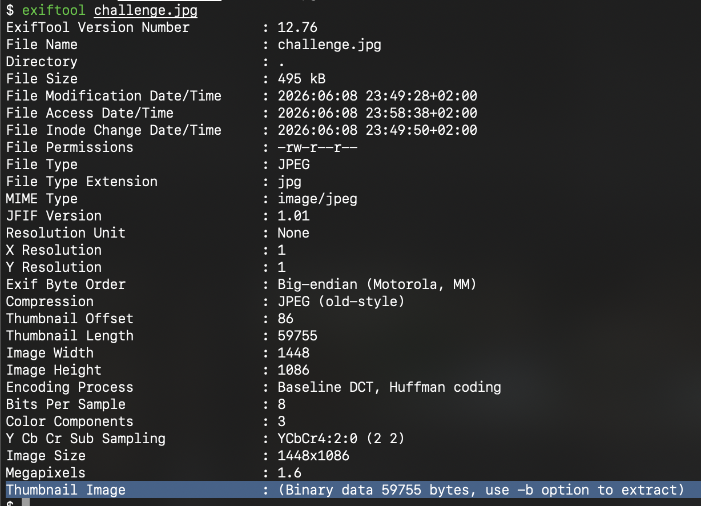
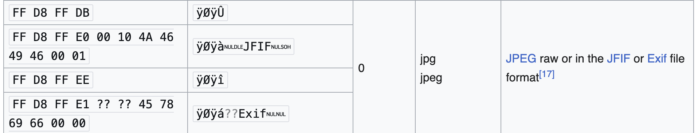
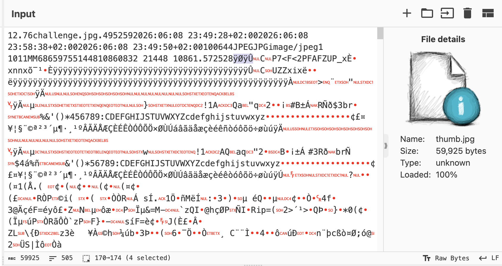
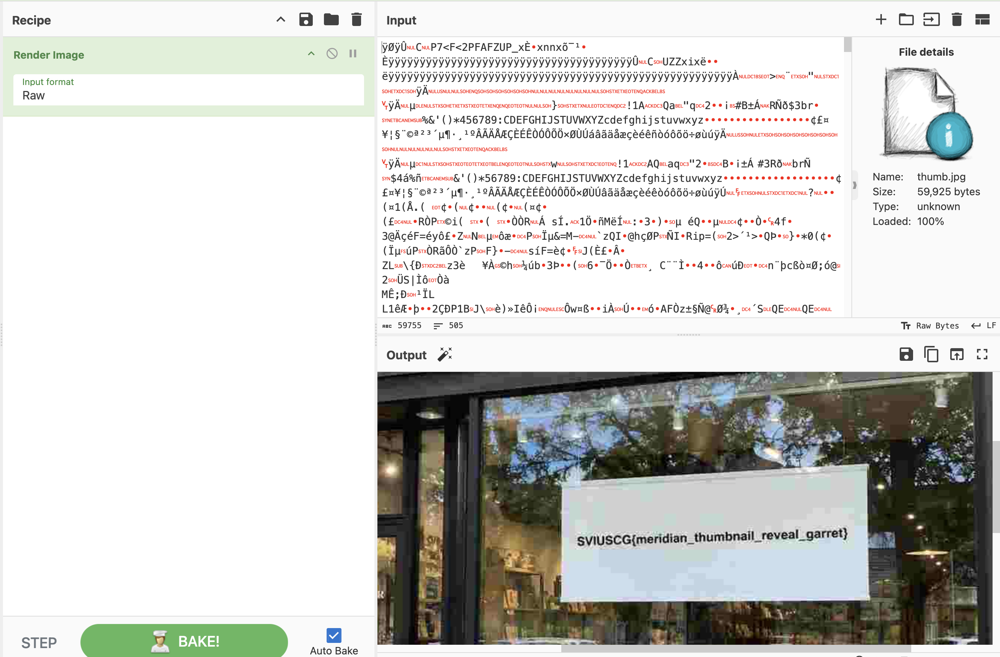

[← US Cyber Open Season VI Writeups](/blog/us-cyber-open-season-vi-writeups)

We get an image that may have been tampered with. exiftool shows us there is a thumbnail in the metadata.

extract it with `exiftool -b challenge.jpg > thumb.jpg`

the file isn’t renderable, so look for the [jpeg magic bytes](https://en.wikipedia.org/wiki/List_of_file_signatures) 

and crop the image to start with `ÿØÿÛ`

Flag: `SVIUSCG{meridian_thumbnail_reveal_garret}`
