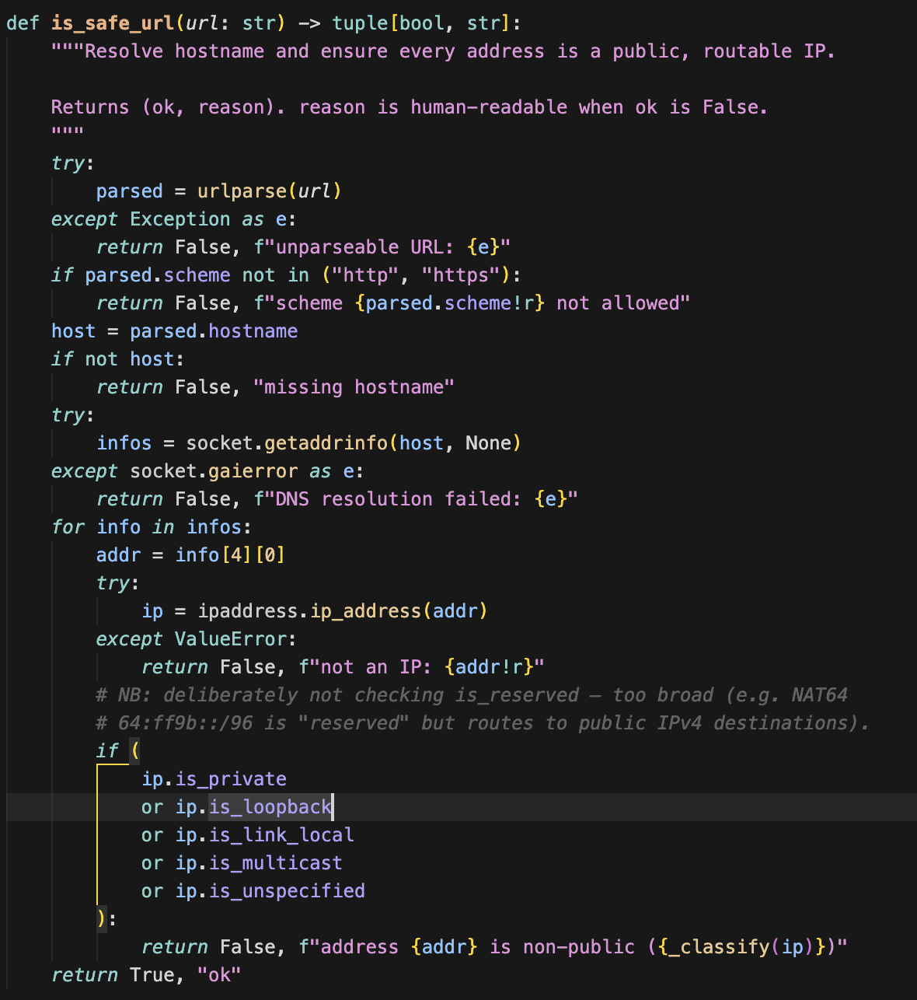
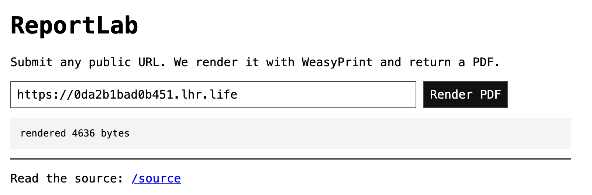
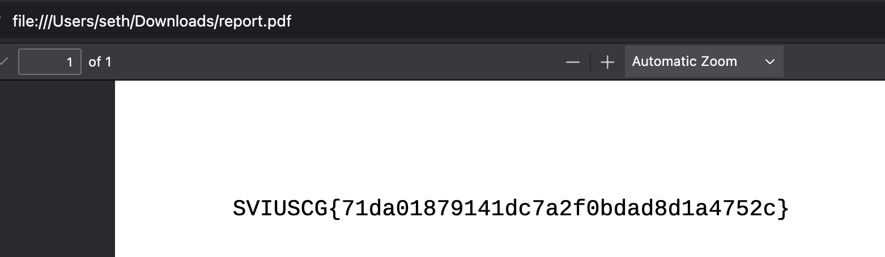

[← US Cyber Open Season VI Writeups](/blog/us-cyber-open-season-vi-writeups)


This challenge has two servers, one accessible to us on port 443 and one only accessible on localhost of the server on port 8080. There appear to be two hurdles to getting the flag which are:

1. Getting the localhost site to leak the /flag.txt file
2. Getting the internet-accessible webapp to access the localhost site and feed us the result

Starting with 2, let’s look at the handler for `/docs/` on localhost:8080


Looks like it checks for path traversal, but then does a url decode afterwards. That means we should be able to just double url-encode so that the check checks against `%2E%2E` and doesn’t block the path traversal. Let’s try `http://127.0.0.1:8080/docs/%252E%252E/%252E%252E/flag.txt` 

- `http://127.0.0.1:8080/docs/%2E%2E/%2E%2E/flag.txt` on path traversal check
- `http://127.0.0.1:8080/docs/../../flag.txt` after the second url-decode

And now for getting the internet-facing app on port 443 to actually query itself on localhost. Luckily for us it has a feature to make a copy of a site as a PDF and serve it to us.



Unfortunately, it checks if the ip is loopback, so we can’t directly input the 127.0.0.1 link. We can however set up a site that redirects to `http://127.0.0.1:8080/docs/%252E%252E/%252E%252E/flag.txt`. That way it passes the initial check, redirects to localhost, then saves the PDF for us.

I set up a very basic flask app for this redirect:

```python
from flask import Flask, redirect, url_for

app = Flask(__name__)

@app.route("/")
def home():
    return redirect("http://127.0.0.1:8080/docs/%252E%252E/%252E%252E/flag.txt")

if __name__ == "__main__":
    app.run(port=8081)

```

Then forwarded it to the internet with `ssh -R 80:localhost:8081 nokey@localhost.run`, my forwarded link being `https://1b12f4ae213410.lhr.life`



Now we just have to submit that and we get the flag!



Flag: `SVIUSCG{71da01879141dc7a2f0bdad8d1a4752c}`
