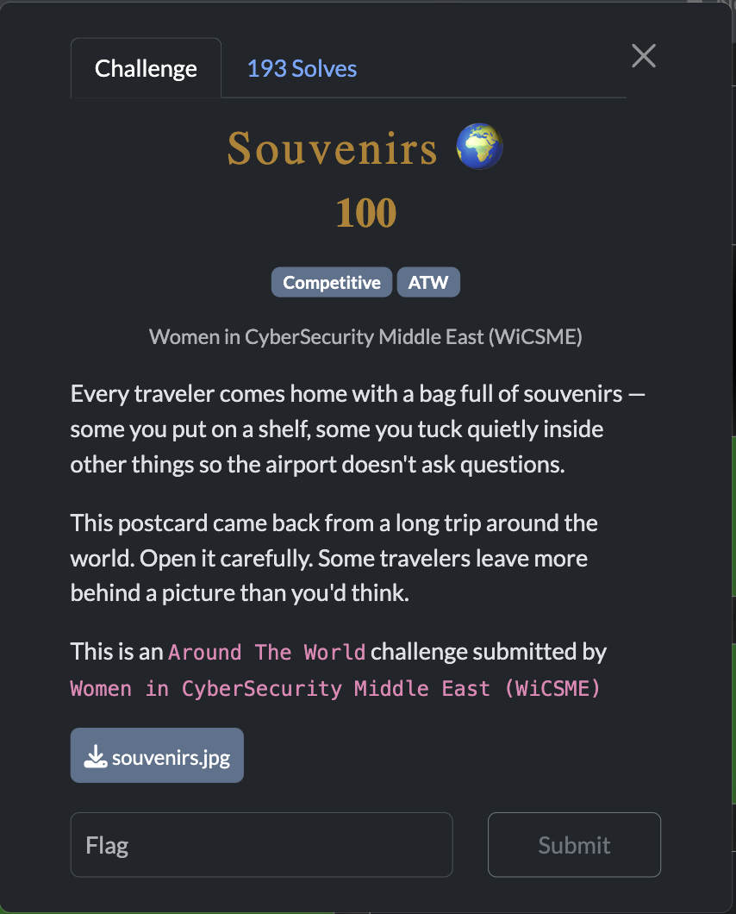
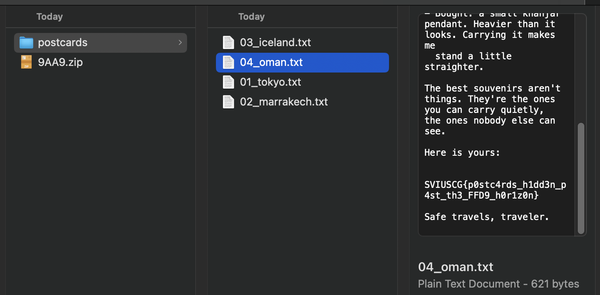

[← US Cyber Open Season VI Writeups](/blog/us-cyber-open-season-vi-writeups)

We got an image file. I ran `binwalk -Me souvenirs.jpg` and flag is in one of the text files it carved out of the jpeg.

Flag: `SVIUSCG{p0stc4rds_h1dd3n_p4st_th3_FFD9_h0r1z0n}`
