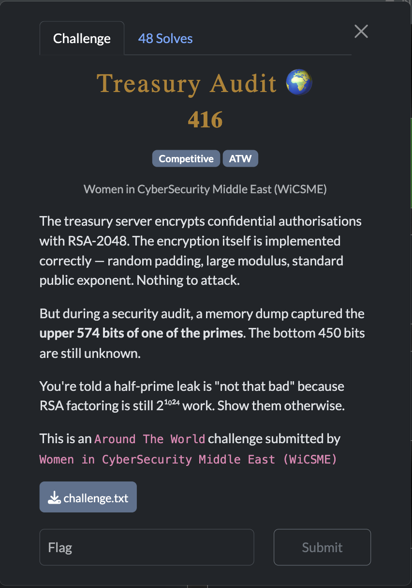
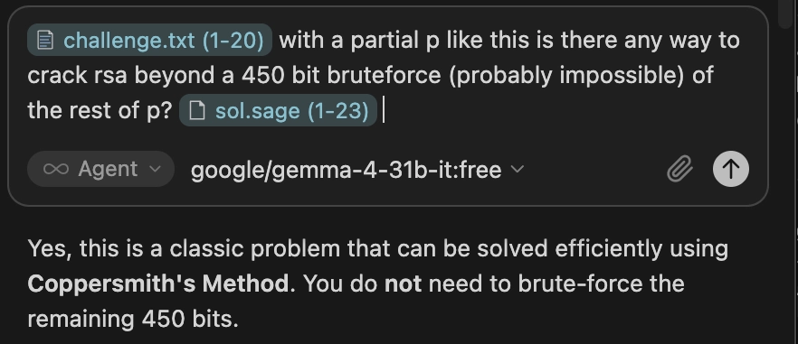
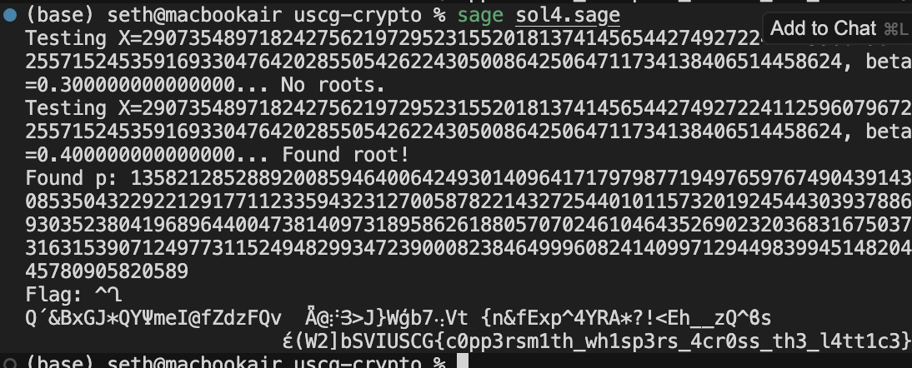

[← US Cyber Open Season VI Writeups](/blog/us-cyber-open-season-vi-writeups)



gemma-4-31b-it solved this one almost entirely on its own. I had to tell it to add some assertions in the code to make sure it was finding valid factors, but after that it was able to fix its own mistakes and solve the challenge.



```python
from Crypto.Util.number import long_to_bytes

# Parameters from challenge.txt
n = 20617455663957563943267326918617398723675048338700713508388960337975656074956983954064553970232006105633822724545049106949889041967134068405950797243962890380652813070549392311724315694576720318394577417831762411162063790168382307801789490753058437672849231668739056316117671801790905154610394734059247857646044105297843204679863793846337246723259252782851848506544277634589232584330688766380641104405598348156924547283668145466744363813519320248440414734847004384358617700598907088226681244793505417553863937933376546436886127459797975723513300591424081072414325387861807381952526820669185389031630281315242655170717
e = 65537
p_high = 135821285288920085946400642493014096417179798771949765976749043914308535043229221291771123359432312700587822143272544010115732019245443039378869303523804196896440047381409730337025746802127495444758067618759291612503761938664380636654095888464531365956441579793480169836657177615766339596852373964556817399808
c = 15399453910127061789675963240803320036190619586685886168849952792176844266710864840696934360866933747435426651819430663651239409026723624056591682946786774471942295921105659579581045823901601924759841105403281205054712833860982070982224894217765296106283067730766592746637151191786740864644672613168298236545616220412521561818761283896777842924383090123845548849139149118912752576502103168975646962571588150298263392656503798048473829431960775446201697629078858470141849733084816666011136002572028379569782708766506079759764753618433774520470069158597532689469756907803181662085381061072253761074271076342865689340509

# Search parameters
for X_val in [2^450, 2^451, 2^455]:
    for beta_val in [0.3, 0.4, 0.5]:
        print(f"Testing X={X_val}, beta={beta_val}...", end=" ")
        P.<x> = PolynomialRing(Zmod(n))
        f = x + p_high
        
        try:
            roots = f.small_roots(X=X_val, beta=beta_val)
            if roots:
                print("Found root!")
                potential_p = gcd(int(p_high + roots[0]), n)
                
                if 1 < potential_p < n:
                    p = int(potential_p)
                    # ASSERTION 1: Is p actually prime?
                    if is_prime(p):
                        q = n // p
                        # ASSERTION 2: Does it correctly factor n?
                        if p * q == n:
                            phi = (p - 1) * (q - 1)
                            d = pow(e, -1, phi)
                            m = pow(c, d, n)
                            
                            # ASSERTION 3: Is m a valid encoded string?
                            # Check if it starts with a typical flag prefix (e.g., 'uscg{')
                            decrypted = long_to_bytes(int(m)).decode(errors='ignore')
                            if "uscg" in decrypted.lower():
                                print(f"Found p: {p}")
                                print(f"Flag: {decrypted}")
                                exit()
                            else:
                                print("Decrypted output is garbage. Factor was a false positive.")
                        else:
                            print("GCD failed to correctly factor n.")
                    else:
                        print("GCD was found but is not a prime.")
                else:
                    print("GCD was trivial.")
        except Exception as e_msg:
            print(f"Error: {e_msg}")
            continue
        else:
            print("No roots.")

print("All attempts failed.")
```



Flag: `SVIUSCG{c0pp3rsm1th_wh1sp3rs_4cr0ss_th3_l4tt1c3}`
